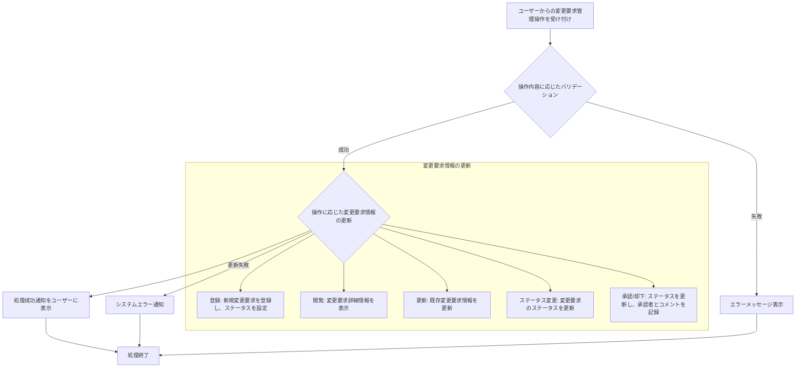

# ID: RDD-FRQ-2025-012

# 機能: 要求変更管理機能

## 概要

プロジェクトに対する要求変更を登録、承認ワークフローを管理し、そのライフサイクル（新規、承認待ち、承認済み、却下、完了など）を追跡する機能です。これにより、ITプロジェクトにおける頻繁な要求変更を体系的に管理し、無秩序な変更によるプロジェクトの混乱を防ぎます。

### 入力

- 変更要求ID: 文字列, 必須, 処理対象の変更要求の一意な識別子
- タイトル: 文字列, 最大255文字, 必須, 変更要求のタイトル
- 内容: テキストエリア, 必須, 変更要求の詳細内容
- 理由: テキストエリア, 必須, 変更要求の理由
- 提案者ID: 文字列, 必須, 変更要求を提出したユーザーのID
- 緊急度: 文字列, 必須, 「高」「中」「低」のいずれか
- ステータス: 文字列, 必須, 「新規」「承認待ち」「承認済み」「却下」「完了」など
- 承認者ID: 文字列, 任意, 承認を行ったユーザーのID
- 承認コメント: テキストエリア, 任意, 承認/却下時のコメント

### 処理内容

1. ユーザーからの変更要求管理操作（登録、閲覧、更新、ステータス変更、承認/却下）を受け付ける。
1. 操作内容に応じて以下のバリデーションを行う。
   - 登録・更新時: タイトル、内容、理由、提案者ID、緊急度が空でないこと、タイトルが255文字以内であること。
   - 閲覧・更新・ステータス変更・承認/却下時: 指定された変更要求IDが存在すること。
   - 承認/却下時: ユーザーが承認権限を持つこと。
1. バリデーションが成功した場合、操作に基づいて変更要求情報と関連するタスク情報を更新する。
   - **登録**: 新規変更要求を登録し、ステータスを「新規」または「承認待ち」に設定する。
   - **閲覧**: 指定された変更要求の詳細情報を表示する。
   - **更新**: 既存変更要求のタイトル、内容、理由、緊急度などを更新する。
   - **ステータス変更**: 変更要求のステータスを更新する。
   - **承認/却下**: 変更要求のステータスを「承認済み」または「却下」に更新し、承認者IDと承認コメントを記録する。
1. 変更要求情報の更新が完了したら、ユーザーに処理成功の通知を行う。

### 出力

- 成功時: 「変更要求を[登録/更新/承認/却下]しました。」というメッセージ
- エラー時: エラーメッセージ (後述)

### エラー処理

- 必須項目不足: 「[項目名]を入力してください。」, 画面上の該当入力フィールドの下にメッセージを表示, 変更要求は処理されない。
- 無効な変更要求ID: 「指定された変更要求が見つかりません。」, 画面上部にメッセージを表示, 変更要求は処理されない。
- 権限不足: 「この操作を行う権限がありません。」, 画面上部にメッセージを表示, 変更要求は処理されない。
- システムエラー: 「変更要求の[処理内容]中にエラーが発生しました。再度お試しください。」, 画面上部にメッセージを表示, 変更要求は処理されない。

### 関連するユースケース

- UC-011 (要求変更を管理し、影響範囲を確認する)

### 関連する業務フロー

- BF-004 (週次レビューフロー)

### 関連する非機能要件

- NFR-002 (セキュリティ): 承認権限の管理を適切に行うこと。
- NFR-003
  (信頼性): データ更新時の整合性を保ち、エラー発生時に適切なフィードバックを提供すること。

### 関連する画面

- SCR-013 (変更要求管理画面)
- SCR-021 (変更要求詳細画面)
