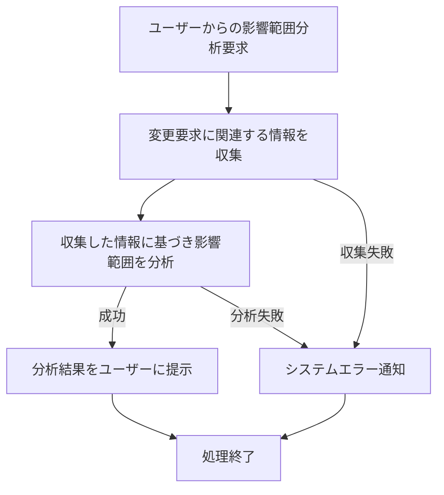

# ID: RDD-FRQ-2025-013

# 機能: 影響範囲分析機能

## 概要

承認された変更要求がプロジェクト全体に与える影響範囲（関連するタスク、成果物、スケジュールなど）を分析し、提示する機能です。これにより、変更によるリスクを早期に特定し、適切な対応を計画できます。

### 入力

- 変更要求ID: 文字列, 必須, 影響範囲を分析する変更要求の一意な識別子

### 処理内容

1. ユーザーからの影響範囲分析要求を受け付ける。
1. 指定された変更要求に関連するタスク、成果物、プロジェクト、スケジュール情報を収集する。
1. 収集した情報に基づき、変更要求が与える影響範囲を分析する。
   - 影響を受けるタスクの特定とその進捗への影響。
   - 影響を受ける成果物の特定とその内容への影響。
   - スケジュールへの影響（期日の変更、クリティカルパスへの影響など）。
   - リソース配分への影響。
1. 分析結果をユーザーに提示する。

### 出力

- 成功時: 影響範囲分析結果（影響を受けるタスク、成果物、スケジュール、リソースなどのリストと詳細）
- エラー時: エラーメッセージ (後述)

### エラー処理

- 無効な変更要求ID: 「指定された変更要求が見つかりません。」, 画面上部にメッセージを表示, 分析は行われない。
- 分析データ不足: 「影響範囲分析に必要なデータが不足しています。」, 画面上部に警告メッセージを表示, 部分的な分析結果が表示される。
- システムエラー: 「影響範囲分析中にエラーが発生しました。再度お試しください。」, 画面上部にメッセージを表示, 分析は行われない。

### 関連するユースケース

- UC-011 (要求変更を管理し、影響範囲を確認する)

### 関連する業務フロー

- BF-004 (週次レビューフロー)

### 関連する非機能要件

- NFR-004 (パフォーマンス): 迅速に影響範囲分析を実行し、結果を提示できること。
- NFR-003
  (信頼性): 分析結果の正確性を保証し、エラー発生時に適切なフィードバックを提供すること。

### 関連する画面

- SCR-014 (影響範囲分析結果画面)
