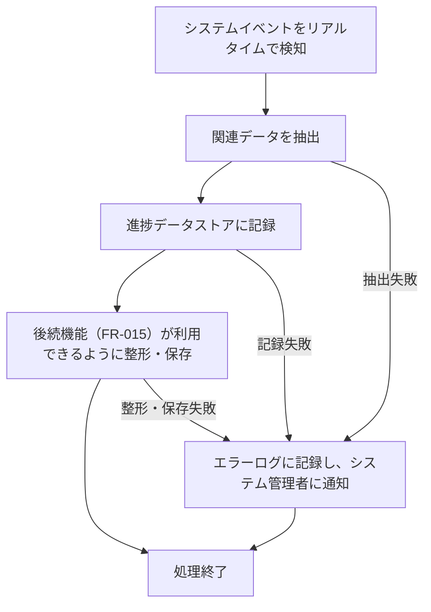

# ID: RDD-FRQ-2025-014

# 機能: リアルタイム進捗データ収集機能

## 概要

プロジェクトの進捗状況をリアルタイムで把握するために、タスクの更新、成果物の変更、ユーザーの活動など、システム内のあらゆる関連データを継続的に収集する機能です。これにより、常に最新のデータに基づいた進捗管理を可能にします。

### 入力

- システム内の各種イベント（タスクの作成、更新、完了、成果物の登録、変更要求のステータス変更など）

### 処理内容

1. システム内で発生する以下のイベントをリアルタイムで検知する。
   - タスクの作成、更新、完了、削除
   - 成果物の登録、更新、削除
   - 変更要求のステータス変更
   - プロジェクトの作成、更新、削除
   - ユーザーの活動（ログイン、ログアウトなど、必要に応じて）
1. 検知したイベントから関連するデータを抽出し、進捗データストアに記録する。
   - タスクの進捗率、ステータス、期日、担当者
   - 成果物のステータス、関連タスク
   - 変更要求のステータス、影響範囲
   - プロジェクトの全体進捗、予算、リソース配分
1. 収集したデータは、後続のリアルタイム進捗データ分析機能（FR-015）が利用できるように整形・保存される。

### 出力

- 成功時: 進捗データストアへのデータ記録
- エラー時: エラーログへの記録

### エラー処理

- データ収集失敗: 関連するイベントデータが正しく収集できなかった場合、エラーログに記録し、システム管理者に通知する。ただし、システム全体の動作は継続する。
- データ保存失敗: 収集したデータの保存に失敗した場合、エラーログに記録し、システム管理者に通知する。再試行メカニズムを導入する。

### 関連するユースケース

- UC-012 (リアルタイム進捗ダッシュボードでプロジェクト状況を把握する)

### 関連する業務フロー

- なし (バックグラウンド処理)

### 関連する非機能要件

- NFR-004 (パフォーマンス): リアルタイムでのデータ収集が可能であること。
- NFR-003 (信頼性): データ収集の漏れがなく、正確性が保証されること。
- NFR-005 (スケーラビリティ): 大量のイベント発生時にも対応できること。

### 関連する画面

- SCR-015 (リアルタイム進捗ダッシュボード画面)
