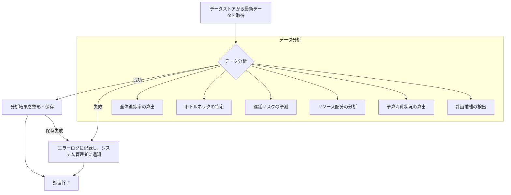

# ID: RDD-FRQ-2025-015

# 機能: リアルタイム進捗データ分析機能

## 概要

収集されたリアルタイム進捗データ（FR-014）を分析し、プロジェクト全体の進捗状況、各タスクのステータス、ボトルネック、遅延リスク、リソース配分状況などを算出・予測する機能です。これにより、プロジェクトマネージャーは常に最新かつ予測的な情報を得て、迅速な意思決定を行うことができます。

### 入力

- リアルタイム進捗データストアに記録されたデータ（FR-014によって収集されたデータ）

### 処理内容

1. リアルタイム進捗データストアから最新のデータを取得する。
1. 取得したデータに基づき、以下の分析を行う。
   - **全体進捗率の算出**: 完了タスク数、残タスク数、タスクの重み付けなどからプロジェクト全体の進捗率を算出する。
   - **ボトルネックの特定**: 依存関係、リソース配分、タスクの進捗状況などから、プロジェクトのボトルネックとなっているタスクやリソースを特定する。
   - **遅延リスクの予測**: タスクの進捗状況、期日、依存関係などから、遅延する可能性のあるタスクやプロジェクトを予測する。
   - **リソース配分の分析**: 各チームメンバーやリソースへのタスク割り当て状況を分析する。
   - **予算消費状況の算出**: 関連するコストデータとタスクの進捗状況から、予算消費状況を算出する。
   - **計画乖離の検出**: 計画データと実績データを比較し、乖離が発生している箇所を自動で検出する。
1. 分析結果をリアルタイム進捗ダッシュボード表示機能（FR-016）が利用できるように整形・保存する。

リアルタイム進捗データ分析機能の処理フローを示します。

### 出力

- 成功時: 分析結果データ（全体進捗率、ボトルネックタスク、遅延リスクタスク、リソース配分、予算消費状況、計画乖離アラートなど）
- エラー時: エラーログへの記録

### エラー処理

- データ分析失敗: 分析に必要なデータが不足している、または分析処理中にエラーが発生した場合、エラーログに記録し、システム管理者に通知する。部分的な分析結果を返すか、分析不可を通知する。
- システムエラー: 分析システム自体に問題が発生した場合、エラーログに記録し、システム管理者に通知する。

### 関連するユースケース

- UC-012 (リアルタイム進捗ダッシュボードでプロジェクト状況を把握する)

### 関連する業務フロー

- なし (バックグラウンド処理)

### 関連する非機能要件

- NFR-004 (パフォーマンス): リアルタイムでのデータ分析が可能であること。
- NFR-003 (信頼性): 分析結果の正確性が保証されること。
- NFR-005 (スケーラビリティ): 大量のデータ量や複雑な分析要求にも対応できること。

### 関連する画面

- SCR-015 (リアルタイム進捗ダッシュボード画面)
