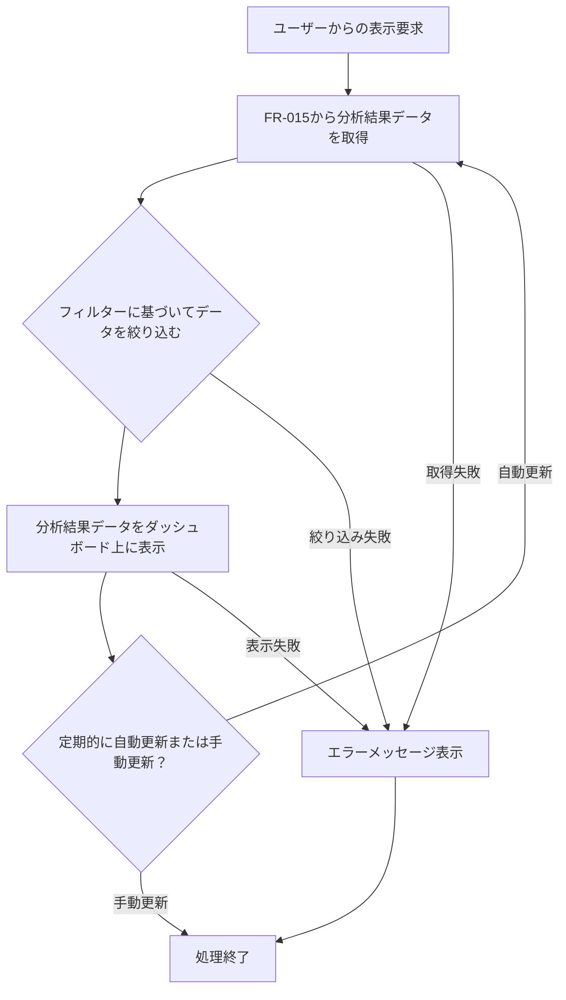

# ID: RDD-FRQ-2025-016

# 機能: 進捗ダッシュボード表示機能

## 概要

リアルタイム進捗データ分析機能（FR-015）によって分析されたプロジェクトの進捗状況を、視覚的に分かりやすいダッシュボード形式で表示する機能です。プロジェクトマネージャーは、全体進捗率、タスクのステータス、ボトルネック、遅延リスク、リソース配分、予算消費状況などを一目で把握できます。

### 入力

- リアルタイム進捗データ分析機能（FR-015）によって生成された分析結果データ
- ユーザーからの表示フィルター（プロジェクト選択など）

### 処理内容

1. ユーザーからの進捗ダッシュボード表示要求を受け付ける。
1. リアルタイム進捗データ分析機能（FR-015）から最新の分析結果データを取得する。
1. ユーザーが指定したフィルター（例: プロジェクト選択）に基づいてデータを絞り込む。
1. 取得した分析結果データを、以下の視覚要素を用いてダッシュボード上に表示する。
   - 全体進捗率（パーセンテージ、プログレスバーなど）
   - 完了タスク数、残タスク数
   - ボトルネックタスク、遅延リスクタスクのリスト
   - リソース配分グラフ
   - 予算消費状況（数値、グラフ）
   - 計画乖離アラート
1. ダッシュボードは定期的に自動更新されるか、ユーザーの手動操作で更新される。

進捗ダッシュボード表示機能の処理フローを示します。

### 出力

- 成功時: リアルタイム進捗ダッシュボードの画面表示
- エラー時: エラーメッセージ (後述)

### エラー処理

- データ取得失敗: 分析結果データの取得に失敗した場合、「データの取得に失敗しました。再度お試しください。」, 画面上部にメッセージを表示, ダッシュボードは表示されないか、古いデータが表示される。
- システムエラー: ダッシュボードの表示処理中にエラーが発生した場合、「ダッシュボードの表示中にエラーが発生しました。再度お試しください。」, 画面上部にメッセージを表示, ダッシュボードは表示されない。

### 関連するユースケース

- UC-012 (リアルタイム進捗ダッシュボードでプロジェクト状況を把握する)

### 関連する業務フロー

- BF-004 (週次レビューフロー)

### 関連する非機能要件

- NFR-008
  (ユーザビリティ): 視覚的に分かりやすく、直感的に操作できるダッシュボードであること。
- NFR-004
  (パフォーマンス): リアルタイム性を保ち、迅速にダッシュボードを表示・更新できること。

### 関連する画面

- SCR-015 (リアルタイム進捗ダッシュボード画面)
