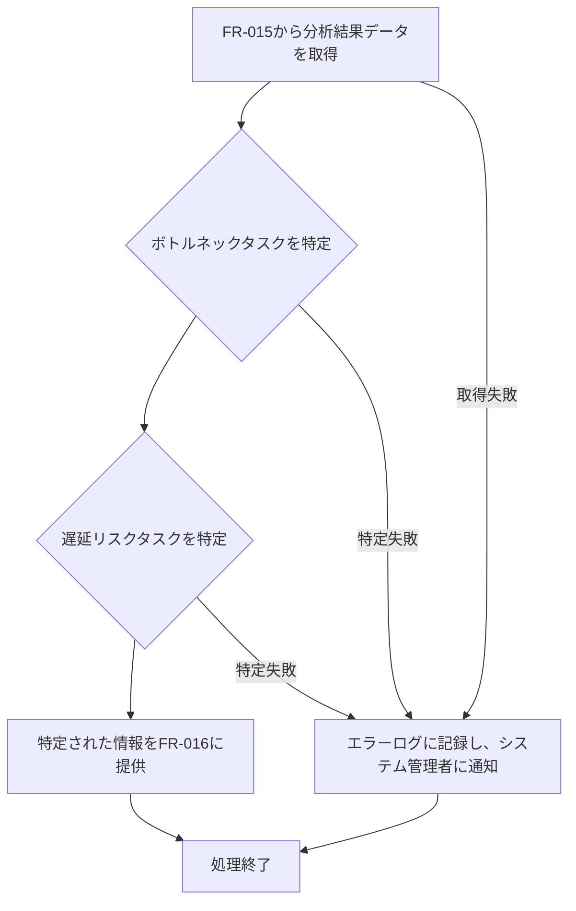

# ID: RDD-FRQ-2025-017

# 機能: ボトルネック・遅延リスク特定機能

## 概要

リアルタイム進捗データ分析機能（FR-015）と連携し、プロジェクトの進捗を阻害しているボトルネックタスクや、期日遅延の可能性が高い遅延リスクタスクを自動的に特定し、プロジェクトマネージャーに提示する機能です。これにより、問題の早期発見と迅速な対応を支援します。

### 入力

- リアルタイム進捗データ分析機能（FR-015）によって生成された分析結果データ

### 処理内容

1. リアルタイム進捗データ分析機能（FR-015）から最新の分析結果データを取得する。
1. 取得したデータに基づき、以下のロジックでボトルネックタスクと遅延リスクタスクを特定する。
   - **ボトルネックタスクの特定**:
     - 依存関係上のクリティカルパスに位置し、かつ進捗が遅れているタスク。
     - 特定のリソースにタスクが集中しており、そのリソースが飽和状態にあるタスク。
     - 過去のデータから完了に時間がかかると予測されるタスク。
   - **遅延リスクタスクの特定**:
     - 期日が迫っているにも関わらず、進捗が著しく遅れているタスク。
     - 依存する先行タスクが遅延しているタスク。
     - 過去の類似タスクの完了実績と比較して、遅延傾向にあるタスク。
1. 特定されたボトルネックタスクと遅延リスクタスクの情報を、進捗ダッシュボード表示機能（FR-016）に提供する。

### 出力

- 成功時: ボトルネックタスクと遅延リスクタスクのリスト
- エラー時: エラーログへの記録

### エラー処理

- データ不足: 分析に必要なデータが不足している場合、エラーログに記録し、システム管理者に通知する。特定できない旨を通知する。
- システムエラー: 特定処理中にエラーが発生した場合、エラーログに記録し、システム管理者に通知する。

### 関連するユースケース

- UC-012 (リアルタイム進捗ダッシュボードでプロジェクト状況を把握する)

### 関連する業務フロー

- なし (バックグラウンド処理)

### 関連する非機能要件

- NFR-003 (信頼性): 特定の正確性が保証されること。
- NFR-004 (パフォーマンス): リアルタイムでの特定が可能であること。

### 関連する画面

- SCR-015 (リアルタイム進捗ダッシュボード画面)
