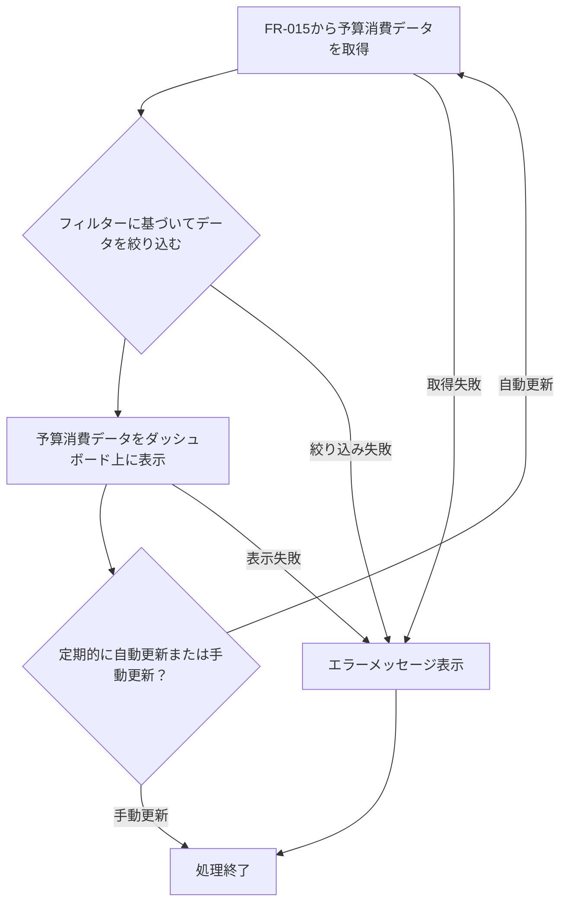

# ID: RDD-FRQ-2025-019

# 機能: 予算消費表示機能

## 概要

プロジェクトの予算消費状況をリアルタイムで表示する機能です。計画予算と実績消費額を比較し、予算超過のリスクを早期に検知できるようにします。

### 入力

- リアルタイム進捗データ分析機能（FR-015）によって生成された分析結果データ
- ユーザーからの表示フィルター（プロジェクト選択、期間指定など）

### 処理内容

1. リアルタイム進捗データ分析機能（FR-015）から最新の分析結果データ（予算消費に関する情報）を取得する。
1. ユーザーが指定したフィルターに基づいてデータを絞り込む。
1. 取得した予算消費データを、以下の視覚要素を用いてダッシュボード上に表示する。
   - 計画予算と実績消費額の比較（数値、バーグラフなど）
   - 予算消化率
   - 予算超過予測
   - 各タスクやフェーズごとの予算消費内訳
1. 表示は定期的に自動更新されるか、ユーザーの手動操作で更新される。

### 出力

- 成功時: 予算消費状況を示すグラフやリストデータ
- エラー時: エラーメッセージ (後述)

### エラー処理

- データ取得失敗: 分析結果データの取得に失敗した場合、「予算消費データの取得に失敗しました。再度お試しください。」, 画面上部にメッセージを表示, 表示は行われないか、古いデータが表示される。
- システムエラー: 表示処理中にエラーが発生した場合、「予算消費表示中にエラーが発生しました。再度お試しください。」, 画面上部にメッセージを表示, 表示は行われない。

### 関連するユースケース

- UC-012 (リアルタイム進捗ダッシュボードでプロジェクト状況を把握する)

### 関連する業務フロー

- なし (情報参照)

### 関連する非機能要件

- NFR-008
  (ユーザビリティ): 予算消費状況を直感的に理解できる視覚的な表現を提供すること。
- NFR-004 (パフォーマンス): 迅速に予算消費情報を表示・更新できること。

### 関連する画面

- SCR-015 (リアルタイム進捗ダッシュボード画面)
