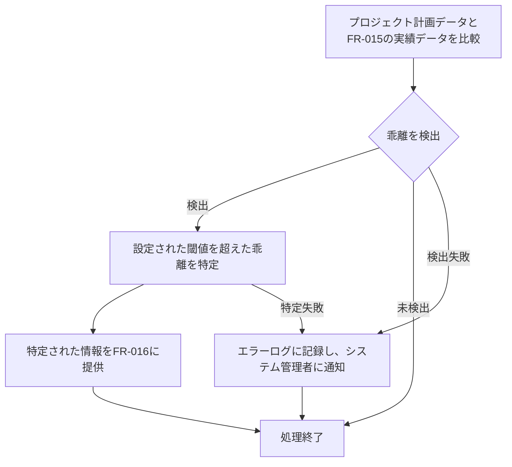

# ID: RDD-FRQ-2025-020

# 機能: 計画乖離自動検出機能

## 概要

プロジェクトの計画（スケジュール、予算、リソース配分など）と、リアルタイムで収集・分析された実績データとの乖離を自動的に検出し、プロジェクトマネージャーに警告する機能です。これにより、問題の早期発見と迅速な是正措置を支援します。

### 入力

- プロジェクト計画データ（スケジュール、予算、リソース配分など）
- リアルタイム進捗データ分析機能（FR-015）によって生成された分析結果データ

### 処理内容

1. プロジェクト計画データと、リアルタイム進捗データ分析機能（FR-015）から取得した実績データを比較する。
1. 以下の項目について乖離を検出する。
   - **スケジュール乖離**: 計画されたタスクの完了日と実績の完了日、または予測される完了日の比較。
   - **予算乖離**: 計画された予算と実績の消費額、または予測される消費額の比較。
   - **リソース配分乖離**: 計画されたリソースの割り当てと実績の割り当て、または負荷状況の比較。
   - **スコープ乖離**: 計画された成果物や機能と、実績の成果物や機能の比較（変更要求管理機能と連携）。
1. 設定された閾値（例: スケジュールが5%以上遅延、予算が10%以上超過）を超えた乖離を検出した場合、それを「計画乖離」として特定する。
1. 特定された計画乖離の情報を、進捗ダッシュボード表示機能（FR-016）に提供する。

### 出力

- 成功時: 計画乖離のリスト（乖離の種類、乖離度、影響範囲など）
- エラー時: エラーログへの記録

### エラー処理

- データ不足: 計画データまたは実績データが不足している場合、エラーログに記録し、システム管理者に通知する。検出できない旨を通知する。
- システムエラー: 検出処理中にエラーが発生した場合、エラーログに記録し、システム管理者に通知する。

### 関連するユースケース

- UC-012 (リアルタイム進捗ダッシュボードでプロジェクト状況を把握する)

### 関連する業務フロー

- なし (バックグラウンド処理)

### 関連する非機能要件

- NFR-003 (信頼性): 検出の正確性が保証されること。
- NFR-004 (パフォーマンス): リアルタイムでの検出が可能であること。

### 関連する画面

- SCR-015 (リアルタイム進捗ダッシュボード画面)
