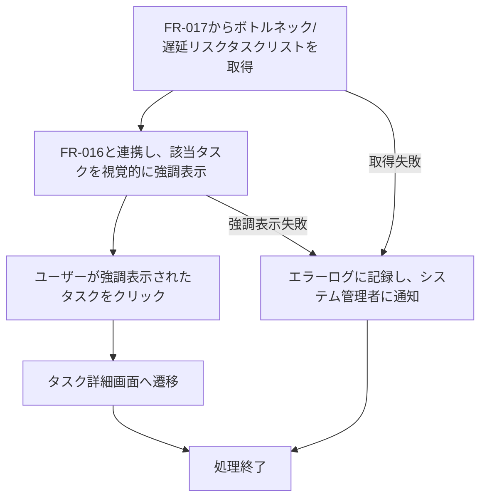

# ID: RDD-FRQ-2025-021

# 機能: ボトルネック・遅延リスクハイライト機能

## 概要

ボトルネック・遅延リスク特定機能（FR-017）によって特定されたタスクを、進捗ダッシュボード（FR-016）上で視覚的に強調表示する機能です。これにより、プロジェクトマネージャーは問題のある箇所を一目で認識し、迅速な対応を促します。

### 入力

- ボトルネック・遅延リスク特定機能（FR-017）によって生成されたボトルネックタスクと遅延リスクタスクのリスト

### 処理内容

1. ボトルネック・遅延リスク特定機能（FR-017）から最新のボトルネックタスクと遅延リスクタスクのリストを取得する。
1. 進捗ダッシュボード表示機能（FR-016）と連携し、ダッシュボード上の該当タスクを以下の方法で視覚的に強調表示する。
   - 色の変更（例: 赤色で表示）
   - アイコンの追加（例: 警告アイコン）
   - 点滅表示
   - リストの最上位への表示
1. ユーザーが強調表示されたタスクをクリックした場合、そのタスクの詳細画面へ遷移できるようにする。

### 出力

- 成功時: 進捗ダッシュボード上でのボトルネック・遅延リスクタスクの視覚的強調表示
- エラー時: エラーログへの記録

### エラー処理

- データ取得失敗: ボトルネック・遅延リスクタスクのリスト取得に失敗した場合、エラーログに記録し、システム管理者に通知する。強調表示は行われない。
- システムエラー: ハイライト処理中にエラーが発生した場合、エラーログに記録し、システム管理者に通知する。

### 関連するユースケース

- UC-012 (リアルタイム進捗ダッシュボードでプロジェクト状況を把握する)

### 関連する業務フロー

- なし (情報表示)

### 関連する非機能要件

- NFR-008
  (ユーザビリティ): 重要な情報を迅速に認識できる視覚的な表現を提供すること。
- NFR-004 (パフォーマンス): リアルタイムでの強調表示が可能であること。

### 関連する画面

- SCR-015 (リアルタイム進捗ダッシュボード画面)
