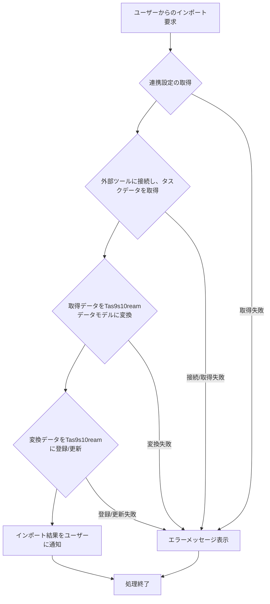

# ID: RDD-FRQ-2025-023

# 機能: タスクインポート機能

## 概要

外部のプロジェクト管理ツールやタスク管理ツールからタスクデータをTas9s10reamにインポートする機能です。既存のツールで管理されているタスクを効率的にTas9s10reamに移行・同期できます。

### 入力

- 連携ツールID: 文字列, 必須, インポート元の外部ツールの一意な識別子
- インポート範囲: オブジェクト, 任意, インポートするタスクの範囲（例: 特定のプロジェクト、期間）
- マッピングルール: オブジェクト, 任意, 外部ツールの項目とTas9s10reamの項目とのマッピング定義

### 処理内容

1. ユーザーからのタスクインポート要求を受け付ける。
1. 指定された連携ツールIDに基づいて、既存ツール連携設定（FR-022）から認証情報と同期設定を取得する。
1. 外部ツールに接続し、指定された範囲のタスクデータを取得する。
1. 取得したタスクデータを、定義されたマッピングルールに従ってTas9s10reamのデータモデルに変換する。
1. 変換されたタスクデータをTas9s10reamに新規タスクとして登録、または既存タスクを更新する。
1. インポートの完了または失敗をユーザーに通知し、インポート結果のサマリー（インポートされたタスク数、エラー数など）を表示する。

タスクインポート機能の処理フローを示します。

### 出力

- 成功時: インポート結果のサマリーメッセージ
- エラー時: エラーメッセージ (後述)

### エラー処理

- 連携設定未定義: 「連携設定が定義されていません。先に連携設定を行ってください。」, 画面上部にメッセージを表示, インポートは実行されない。
- 外部ツール接続失敗: 「外部ツールへの接続に失敗しました。設定を確認してください。」, 画面上部にメッセージを表示, インポートは実行されない。
- データ変換エラー: 「データ変換中にエラーが発生しました。一部のタスクがインポートされませんでした。」, 画面上部にメッセージを表示, 問題のあるデータはスキップされるか、エラーログに記録される。
- システムエラー: 「タスクのインポート中にエラーが発生しました。再度お試しください。」, 画面上部にメッセージを表示, インポートは実行されない。

### 関連するユースケース

- UC-006 (既存ツールからタスクをインポートする)

### 関連する業務フロー

- BF-006 (既存ツール連携フロー)

### 関連する非機能要件

- NFR-003 (信頼性): データインポートの正確性と完全性。
- NFR-005 (スケーラビリティ): 大量のタスクデータも効率的にインポートできること。

### 関連する画面

- SCR-016 (既存ツール連携詳細設定画面)
