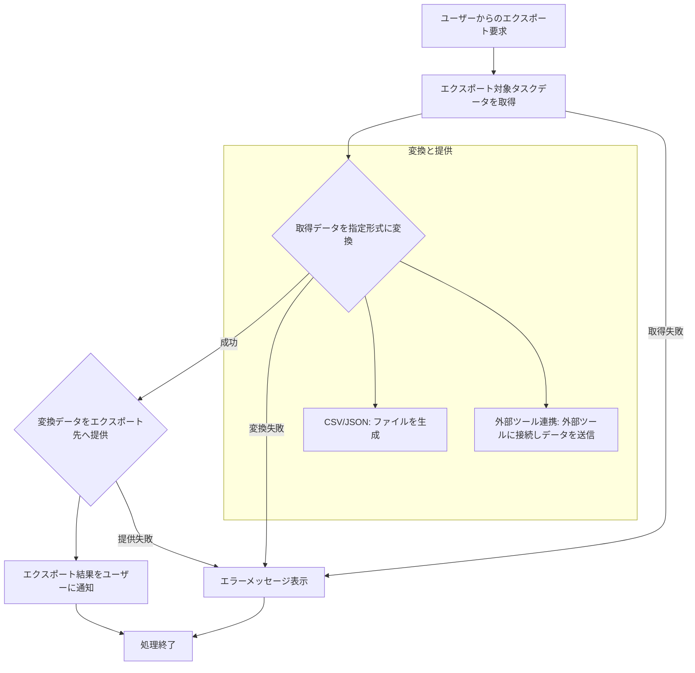

# ID: RDD-FRQ-2025-024

# 機能: タスクエクスポート機能

## 概要

Tas9s10reamに登録されているタスクデータを外部ツールやファイル形式でエクスポートする機能です。データのバックアップ、他のシステムへの移行、レポート作成などに利用できます。

### 入力

- エクスポート対象タスクID: 文字列配列, 任意, エクスポートするタスクの一意な識別子（指定がない場合は全タスク）
- エクスポート形式: 文字列, 必須, 「CSV」「JSON」「外部ツール連携」など
- (エクスポート形式が「外部ツール連携」の場合)
  - 連携ツールID: 文字列, 必須, エクスポート先の外部ツールの一意な識別子
- (オプション) エクスポート範囲: オブジェクト, 任意, エクスポートするタスクの範囲（例: 特定のプロジェクト、期間）
- (オプション) マッピングルール: オブジェクト, 任意,
  Tas9s10reamの項目と外部ツールの項目とのマッピング定義

### 処理内容

1. ユーザーからのタスクエクスポート要求を受け付ける。
1. 指定されたエクスポート対象タスクデータを取得する。
1. 取得したタスクデータを、指定されたエクスポート形式とマッピングルールに従って変換する。
   - **CSV/JSON**: 指定されたファイル形式でデータを生成する。
   - **外部ツール連携**: 指定された外部ツールに接続し、変換されたデータを送信する。
1. エクスポートの完了または失敗をユーザーに通知し、エクスポート結果のサマリーを表示する。

タスクエクスポート機能の処理フローを示します。

### 出力

- 成功時: エクスポートされたファイル、または外部ツールへのデータ送信成功メッセージ
- エラー時: エラーメッセージ (後述)

### エラー処理

- エクスポート形式無効: 「無効なエクスポート形式が指定されました。」, 画面上部にメッセージを表示, エクスポートは実行されない。
- 連携設定未定義（外部ツール連携時）: 「連携設定が定義されていません。先に連携設定を行ってください。」, 画面上部にメッセージを表示, エクスポートは実行されない。
- 外部ツール接続失敗（外部ツール連携時）: 「外部ツールへの接続に失敗しました。設定を確認してください。」, 画面上部にメッセージを表示, エクスポートは実行されない。
- システムエラー: 「タスクのエクスポート中にエラーが発生しました。再度お試しください。」, 画面上部にメッセージを表示, エクスポートは実行されない。

### 関連するユースケース

- なし (直接的なユースケースは定義されていないが、データ連携の一部として利用される)

### 関連する業務フロー

- BF-006 (既存ツール連携フロー)

### 関連する非機能要件

- NFR-003 (信頼性): データエクスポートの正確性と完全性。
- NFR-005
  (スケーラビリティ): 大量のタスクデータも効率的にエクスポートできること。

### 関連する画面

- SCR-016 (既存ツール連携詳細設定画面)
