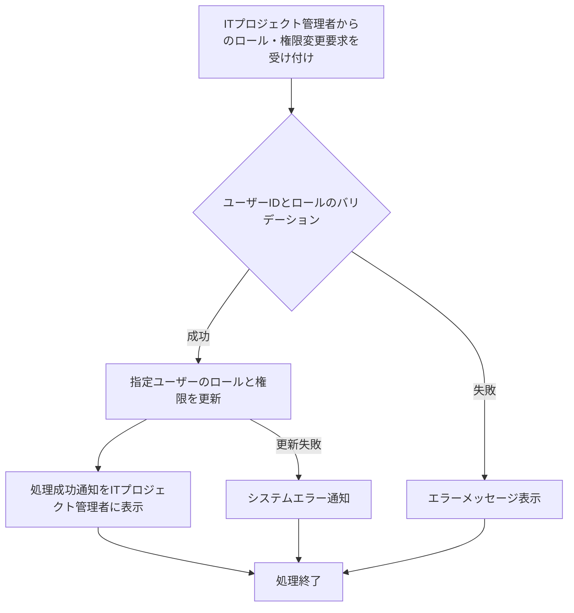

# ID: RDD-FRQ-2025-027

# 機能: ロール・権限管理機能

## 概要

ITプロジェクト管理者がシステム内のユーザーにロール（役割）を割り当て、それに応じた機能へのアクセス権限を管理できる機能です。これにより、最小権限の原則に基づいたアクセス制御を実現し、セキュリティを強化します。

### 入力

- ユーザーID: 文字列, 必須, ロール・権限を変更するユーザーの一意な識別子
- ロール: 文字列, 必須, 「ITプロジェクトメンバー」「ITプロジェクト管理者」のいずれか
- (オプション) 権限: 文字列配列, 任意, ユーザーに付与する個別の権限（例: 「タスク作成」「タスク編集」「プロジェクト作成」「ユーザー管理」など）

### 処理内容

1. ITプロジェクト管理者からのロール・権限変更要求を受け付ける。
1. 入力されたユーザーIDとロールのバリデーションを行う。
   - 指定されたユーザーIDが存在すること。
   - 指定されたロールが有効なロールであること。
1. バリデーションが成功した場合、指定されたユーザーのロールと権限を更新する。
   - ロールに基づいて基本的な権限セットを割り当てる。
   - 個別の権限が指定された場合、それを追加または削除する。
1. ロール・権限の更新が完了したら、ITプロジェクト管理者に処理成功の通知を行う。

### 出力

- 成功時: 「ユーザーのロール・権限を更新しました。」というメッセージ
- エラー時: エラーメッセージ (後述)

### エラー処理

- 無効なユーザーID: 「指定されたユーザーが見つかりません。」, 画面上部にメッセージを表示, 処理は行われない。
- 無効なロール/権限: 「無効なロールまたは権限が指定されました。」, 画面上部にメッセージを表示, 処理は行われない。
- 権限不足: 「この操作を行う権限がありません。」, 画面上部にメッセージを表示, 処理は行われない。
- システムエラー: 「ロール・権限の更新中にエラーが発生しました。再度お試しください。」, 画面上部にメッセージを表示, 処理は行われない。

### 関連するユースケース

- UC-013 (ユーザーを管理する)

### 関連する業務フロー

- なし (システム管理)

### 関連する非機能要件

- NFR-002 (セキュリティ): 最小権限の原則に基づいたアクセス制御を実現すること。
- NFR-003 (信頼性): ロール・権限管理処理の安定性。

### 関連する画面

- SCR-017 (ユーザー管理画面)
