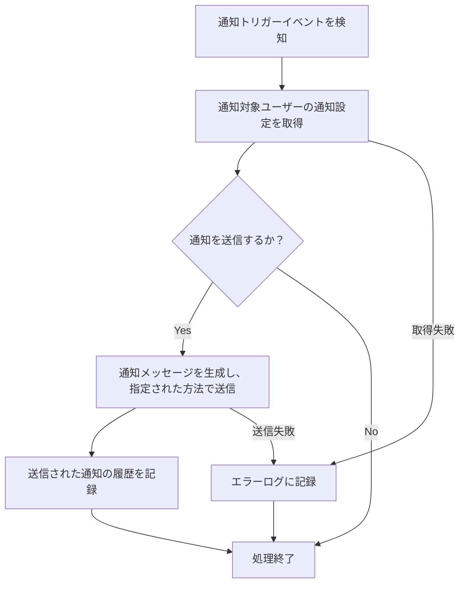

# ID: RDD-FRQ-2025-028

# 機能: システム通知機能

## 概要

システム内で発生する重要なイベント（タスクの期日、タスクの割り当て、プロジェクトの進捗更新、変更要求の承認/却下など）をユーザーに通知する機能です。ユーザーは通知設定（FR-029）に基づいて、通知の種類、方法、頻度をカスタマイズできます。

### 入力

- 通知トリガーイベント: オブジェクト, 必須, 通知を発生させるシステムイベント（例: タスク期日到達、タスク割り当て変更）
- 通知対象ユーザーID: 文字列, 必須, 通知を受け取るユーザーの一意な識別子
- 通知メッセージ: 文字列, 必須, ユーザーに表示するメッセージ内容
- (オプション) 関連タスクID/プロジェクトIDなど: 文字列, 任意, 通知に関連するエンティティのID

### 処理内容

1. システム内で通知トリガーイベントが発生したことを検知する。
1. 通知対象ユーザーの通知設定（FR-029）を取得する。
1. 通知設定に基づいて、通知を送信するかどうか、どの方法（メール、システム内通知、プッシュ通知など）で送信するかを判断する。
1. 通知メッセージを生成し、指定された方法でユーザーに送信する。
   - **システム内通知**: ユーザーのダッシュボードや通知センターにメッセージを表示する。
   - **メール通知**: ユーザーの登録済みメールアドレスにメールを送信する。
   - **プッシュ通知**: モバイルアプリなどにプッシュ通知を送信する（将来的な拡張）。
1. 送信された通知の履歴を記録する。

### 出力

- 成功時: 通知の送信
- エラー時: エラーログへの記録

### エラー処理

- 通知設定無効: ユーザーが通知を無効にしている場合、通知は送信されない。
- 送信失敗: メールサーバーの障害などにより通知の送信に失敗した場合、エラーログに記録し、システム管理者に通知する。再試行メカニズムを導入する。
- システムエラー: 通知処理中にエラーが発生した場合、エラーログに記録し、システム管理者に通知する。

### 関連するユースケース

- UC-014 (システム通知を設定する)

### 関連する業務フロー

- なし (バックグラウンド処理)

### 関連する非機能要件

- NFR-003 (信頼性): 通知が確実にユーザーに届くこと。
- NFR-004 (パフォーマンス): リアルタイムでの通知が可能であること。

### 関連する画面

- SCR-010 (通知設定画面)
