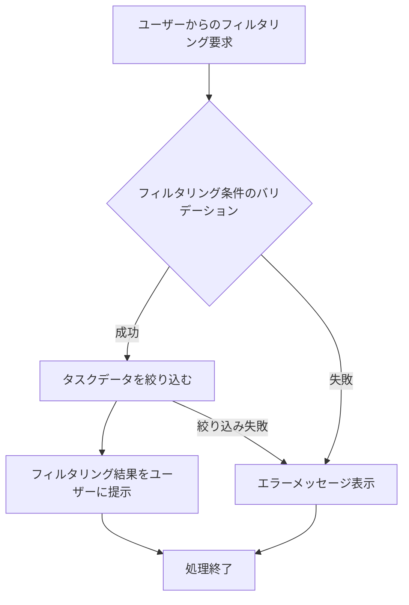

# ID: RDD-FRQ-2025-031

# 機能: タスクフィルタリング機能

## 概要

ユーザーがタスクを様々な条件（期限、担当者、プロジェクト、コンテキスト、ステータスなど）で絞り込み、目的のタスクを効率的に見つけられる機能です。これにより、大量のタスクの中から必要な情報に素早くアクセスできます。

### 入力

- フィルタリング条件: オブジェクト, 必須, 以下のいずれかまたは複数の条件
  - 期限: 日付範囲, オプション
  - 担当者ID: 文字列, オプション
  - プロジェクトID: 文字列, オプション
  - コンテキストID: 文字列, オプション
  - ステータス: 文字列, オプション, 「未着手」「進行中」「完了」「中断」など
  - 優先度: 文字列, オプション, 「高」「中」「低」

### 処理内容

1. ユーザーからのタスクフィルタリング要求を受け付ける。
1. 指定されたフィルタリング条件に基づいて、システム内のタスクデータを絞り込む。
1. フィルタリング結果をユーザーに提示する。

タスクフィルタリング機能の処理フローを示します。

### 出力

- 成功時: フィルタリング条件に合致するタスクのリスト
- エラー時: エラーメッセージ (後述)

### エラー処理

- 無効なフィルタリング条件: 「無効なフィルタリング条件が指定されました。」, 画面上部にメッセージを表示, フィルタリングは実行されない。
- フィルタリング結果なし: 「該当するタスクは見つかりませんでした。」, 画面中央にメッセージを表示, 空のリストが返される。
- システムエラー: 「タスクのフィルタリング中にエラーが発生しました。再度お試しください。」, 画面上部にメッセージを表示, フィルタリングは実行されない。

### 関連するユースケース

- UC-015 (タスクを検索・フィルタリングする)

### 関連する業務フロー

- なし (情報検索)

### 関連する非機能要件

- NFR-004 (パフォーマンス): 迅速にフィルタリング結果を返却できること。
- NFR-008 (ユーザビリティ): 直感的な操作でタスクをフィルタリングできること。

### 関連する画面

- SCR-008 (検索画面)
- SCR-003 (プロジェクト一覧画面)
- SCR-004 (次の行動リスト画面)
