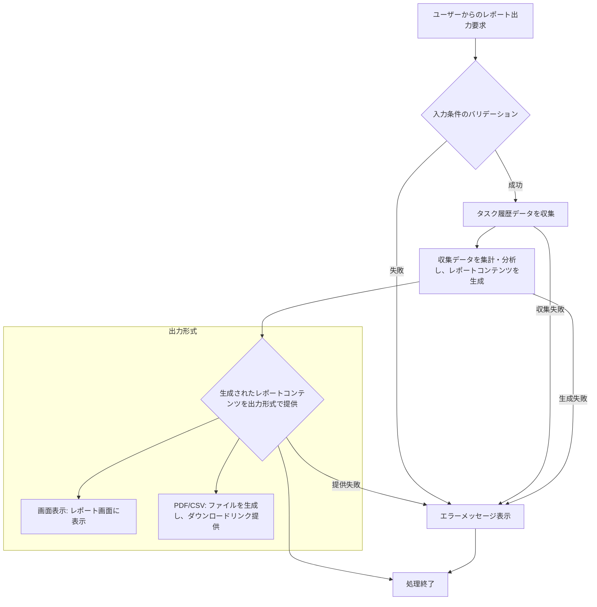

# ID: RDD-FRQ-2025-033

# 機能: タスク履歴レポート出力機能

## 概要

個々のタスクまたはプロジェクト内のタスクの履歴（作成、更新、ステータス変更、担当者変更など）に関するレポートを生成し、表示またはダウンロードできる機能です。タスクのライフサイクルを追跡し、過去の経緯を把握するのに役立ちます。

### 入力

- タスクID: 文字列, 任意, レポート対象のタスクの一意な識別子（指定がない場合は全タスク）
- プロジェクトID: 文字列, 任意, レポート対象のプロジェクトの一意な識別子（指定がない場合は全プロジェクト）
- 期間指定: オブジェクト, 必須, レポート対象期間の開始日と終了日
- 出力形式: 文字列, 必須, 「画面表示」「PDF」「CSV」など

### 処理内容

1. ユーザーからのタスク履歴レポート出力要求を受け付ける。
1. 指定されたタスク、プロジェクト、期間に基づいて、タスクの履歴データ（変更日時、変更内容、変更者など）を収集する。
1. 収集したデータを集計・分析し、タスク履歴レポートのコンテンツを生成する。
   - 各タスクの変更履歴リスト
   - 期間内のタスク変更イベントのサマリー
1. 生成されたレポートコンテンツを指定された出力形式で提供する。
   - **画面表示**: レポート画面（SCR-011）のプレビュー領域に表示する。
   - **PDF/CSV**: ファイルとして生成し、ダウンロードリンクを提供する。

タスク履歴レポート出力機能の処理フローを示します。

### 出力

- 成功時: タスク履歴レポートの表示、またはダウンロードリンク
- エラー時: エラーメッセージ (後述)

### エラー処理

- 期間指定エラー: 「開始日は終了日より前の日付を指定してください。」, 画面上部にメッセージを表示, レポートは生成されない。
- データ不足: 「レポート生成に必要なデータが不足しています。」, 画面上部に警告メッセージを表示, 部分的なレポートが生成されるか、生成できない旨を通知する。
- システムエラー: 「タスク履歴レポートの生成中にエラーが発生しました。再度お試しください。」, 画面上部にメッセージを表示, レポートは生成されない。

### 関連するユースケース

- UC-016 (レポートを生成・閲覧する)

### 関連する業務フロー

- なし (情報参照)

### 関連する非機能要件

- NFR-004 (パフォーマンス): 迅速にレポートを生成できること。
- NFR-003 (信頼性): レポート内容の正確性が保証されること。

### 関連する画面

- SCR-011 (レポート画面)
