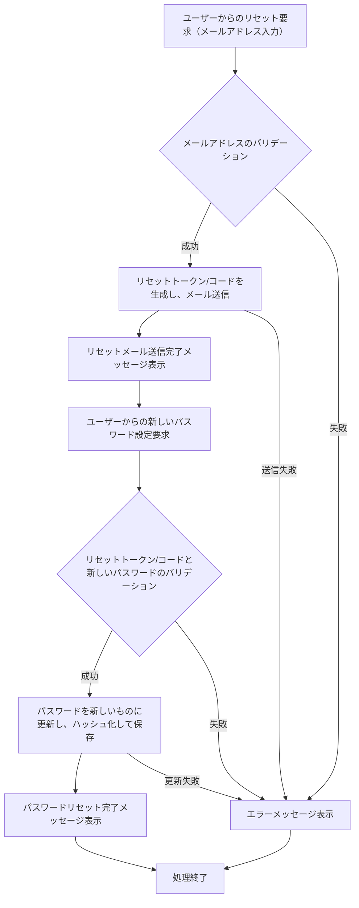

# ID: RDD-FRQ-2025-034

# 機能: パスワードリセット機能

## 概要

ユーザーがパスワードを忘れた際に、登録済みのメールアドレスを使用してパスワードを再設定できる機能です。セキュリティを確保しつつ、ユーザーがシステムにアクセスできるようにします。

### 入力

- メールアドレス: 文字列, 必須, パスワードリセットを要求するユーザーの登録済みメールアドレス
- (パスワード再設定時)
  - リセットトークン/コード: 文字列, 必須, メールで送信されたリセット用のトークンまたはコード
  - 新しいパスワード: 文字列, 必須, 8文字以上、英数字記号を含む

### 処理内容

1. ユーザーからのパスワードリセット要求（メールアドレス入力）を受け付ける。
1. 入力されたメールアドレスのバリデーションを行う。
   - メールアドレスが有効な形式であること。
   - メールアドレスがシステムに登録されていること。
1. バリデーションが成功した場合、パスワードリセット用のユニークなトークンまたはコードを生成し、ユーザーの登録済みメールアドレスに送信する。
1. ユーザーにリセットメール送信完了のメッセージを表示する。
1. ユーザーからの新しいパスワード設定要求（リセットトークン/コードと新しいパスワード入力）を受け付ける。
1. リセットトークン/コードの有効性を検証する。
   - トークン/コードが有効期限内であること。
   - トークン/コードが正しいこと。
1. 新しいパスワードのバリデーションを行う。
   - パスワードが8文字以上で、英数字記号を含むこと。
1. バリデーションが成功した場合、ユーザーのパスワードを新しいパスワードに更新し、ハッシュ化して保存する。
1. パスワードリセット完了のメッセージをユーザーに表示する。

パスワードリセット機能の処理フローを示します。

### 出力

- 成功時: 「パスワードリセットメールを送信しました。」または「パスワードがリセットされました。」というメッセージ
- エラー時: エラーメッセージ (後述)

### エラー処理

- メールアドレス未登録: 「このメールアドレスは登録されていません。」, 画面上部にメッセージを表示, リセットメールは送信されない。
- メールアドレス形式無効: 「有効なメールアドレスを入力してください。」, 画面上部にメッセージを表示, リセットメールは送信されない。
- メール送信失敗: 「パスワードリセットメールの送信に失敗しました。再度お試しください。」, 画面上部にメッセージを表示, リセットメールは送信されない。
- 無効なリセットトークン/コード: 「リセットリンクが無効です。再度パスワードリセット手続きを行ってください。」, 画面上部にメッセージを表示, パスワードはリセットされない。
- リセットトークン/コード有効期限切れ: 「リセットリンクの有効期限が切れました。再度パスワードリセット手続きを行ってください。」, 画面上部にメッセージを表示, パスワードはリセットされない。
- 新しいパスワード形式無効: 「新しいパスワードは8文字以上で、英数字記号を組み合わせてください。」, 画面上部にメッセージを表示, パスワードはリセットされない。
- システムエラー: 「パスワードリセット中にエラーが発生しました。再度お試しください。」, 画面上部にメッセージを表示, パスワードはリセットされない。

### 関連するユースケース

- UC-017 (パスワードをリセットする)

### 関連する業務フロー

- BF-007 (パスワードリセットフロー)

### 関連する非機能要件

- NFR-002 (セキュリティ): パスワードリセットプロセスの安全性を確保すること。
- NFR-003 (信頼性): パスワードリセット処理の安定性。

### 関連する画面

- SCR-001 (ログイン画面)
- SCR-019 (パスワードリセット画面)
