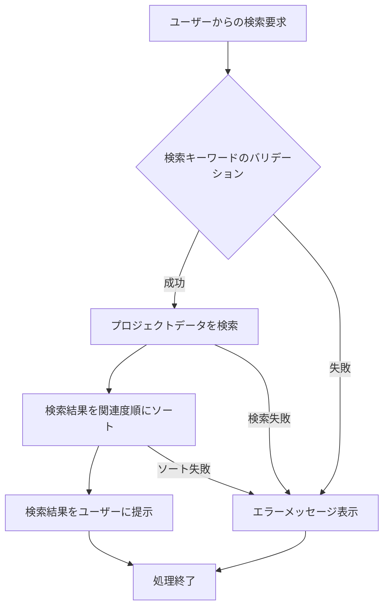

# ID: RDD-FRQ-2025-035

# 機能: プロジェクト検索機能

## 概要

ユーザーがシステム内のプロジェクトをキーワードで検索し、目的のプロジェクトを効率的に見つけられる機能です。プロジェクトの名称、概要などのテキスト情報から関連するプロジェクトを抽出します。

### 入力

- 検索キーワード: 文字列, 必須, 検索対象のキーワード

### 処理内容

1. ユーザーからのプロジェクト検索要求を受け付ける。
1. 検索キーワードに基づいて、システム内のプロジェクトデータ（名称、概要など）を検索する。
1. 検索結果を関連度順にソートし、ユーザーに提示する。

プロジェクト検索機能の処理フローを示します。

### 出力

- 成功時: 検索結果に合致するプロジェクトのリスト
- エラー時: エラーメッセージ (後述)

### エラー処理

- 検索キーワード未入力: 「検索キーワードを入力してください。」, 画面上の検索入力フィールドの下にメッセージを表示, 検索は実行されない。
- 検索結果なし: 「該当するプロジェクトは見つかりませんでした。」, 画面中央にメッセージを表示, 空のリストが返される。
- システムエラー: 「プロジェクトの検索中にエラーが発生しました。再度お試しください。」, 画面上部にメッセージを表示, 検索は実行されない。

### 関連するユースケース

- UC-015 (タスクを検索・フィルタリングする) - 検索画面からの利用

### 関連する業務フロー

- なし (情報検索)

### 関連する非機能要件

- NFR-004 (パフォーマンス): 迅速に検索結果を返却できること。
- NFR-008 (ユーザビリティ): 直感的な操作でプロジェクトを検索できること。

### 関連する画面

- SCR-008 (検索画面)
- SCR-003 (プロジェクト一覧画面)
