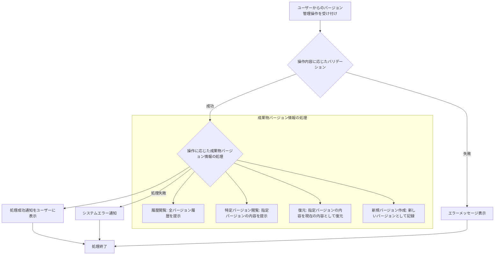

# ID: RDD-FRQ-2025-037

# 機能: 成果物バージョン管理機能

## 概要

成果物の変更履歴を記録し、過去のバージョンを閲覧・復元できる機能です。成果物の変更を追跡し、誤った変更からの復旧や、特定の時点の成果物内容の確認を可能にします。

### 入力

- 成果物ID: 文字列, 必須, バージョン管理対象の成果物の一意な識別子
- (オプション) バージョンID: 文字列, オプション, 閲覧または復元する特定のバージョンの一意な識別子
- (オプション) 変更内容: テキストエリア, オプション, 新しいバージョンを作成する際の変更内容の記述

### 処理内容

1. ユーザーからの成果物バージョン管理操作（履歴閲覧、特定バージョン閲覧、復元、新規バージョン作成）を受け付ける。
1. 操作内容に応じて以下のバリデーションを行う。
   - 指定された成果物IDが存在すること。
   - 指定されたバージョンIDが存在すること（特定バージョン閲覧、復元時）。
1. バリデーションが成功した場合、操作に基づいて成果物のバージョン情報を処理する。
   - **履歴閲覧**: 指定された成果物の全バージョン履歴（バージョンID、変更日時、変更者、変更内容概要）を提示する。
   - **特定バージョン閲覧**: 指定されたバージョンの成果物内容を提示する。
   - **復元**: 指定されたバージョンの成果物内容を現在の内容として復元する。
   - **新規バージョン作成**: 成果物の内容が変更された際に、自動的に新しいバージョンとして記録する。ユーザーが明示的に変更内容を記述することも可能。
1. 処理が完了したら、ユーザーに処理成功の通知を行う。

成果物バージョン管理機能の処理フローを示します。

### 出力

- 成功時: バージョン履歴リスト、特定バージョンの成果物内容、または操作成功メッセージ
- エラー時: エラーメッセージ (後述)

### エラー処理

- 無効な成果物ID: 「指定された成果物が見つかりません。」, 画面上部にメッセージを表示, 処理は行われない。
- 無効なバージョンID: 「指定されたバージョンが見つかりません。」, 画面上部にメッセージを表示, 処理は行われない。
- システムエラー: 「成果物バージョン管理中にエラーが発生しました。再度お試しください。」, 画面上部にメッセージを表示, 処理は行われない。

### 関連するユースケース

- UC-010 (成果物とタスクの依存関係を可視化する)
- UC-011 (要求変更を管理し、影響範囲を確認する)

### 関連する業務フロー

- なし (成果物管理の運用)

### 関連する非機能要件

- NFR-003 (信頼性): 成果物履歴の正確性とデータの整合性を保証すること。
- NFR-005 (スケーラビリティ): 大量のバージョン履歴にも対応できること。

### 関連する画面

- SCR-020 (成果物詳細画面)
