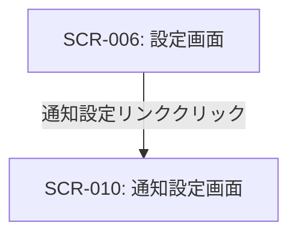

# ID: RDD-SCR-2025-010

# 画面: 通知設定画面

## 画面概要

本画面は、ユーザーがシステムからの通知に関する設定を詳細に行うための画面です。通知の種類、通知方法、通知タイミングなどをカスタマイズできます。

### 画面遷移

### 画面レイアウト

- 通知カテゴリ（例: タスク関連、プロジェクト関連、システムからのお知らせ）ごとに設定項目がグループ化される。
- 各設定項目は、トグルスイッチ、チェックボックス、ドロップダウンなどで構成される。
- 「保存」ボタンで変更を適用。

### 入力項目

- 全体通知ON/OFF: 真偽値, [ON], [ON], 任意, 全ての通知の有効/無効
- タスク期日通知:
  - ON/OFF: 真偽値, [ON], [ON], 任意
  - 通知タイミング: ドロップダウン, [期日前日, 期日当日], [期日前日], 任意
  - 通知方法: 複数選択, [メール, アプリ内], [アプリ内], 任意
- タスク割り当て通知:
  - ON/OFF: 真偽値, [ON], [ON], 任意
  - 通知方法: 複数選択, [メール, アプリ内], [アプリ内], 任意
- プロジェクト進捗通知:
  - ON/OFF: 真偽値, [ON], [ON], 任意
  - 通知頻度: ドロップダウン, [毎日, 毎週], [毎週], 任意
  - 通知方法: 複数選択, [メール, アプリ内], [メール], 任意

### 表示項目

- 各通知カテゴリのタイトルと説明
- 現在の設定値

### 操作とイベント

- 各設定項目の変更: 入力値のバリデーションを行い、有効な場合は一時的に変更を保持。
- 「保存」ボタンクリック: 変更された通知設定をシステムに保存。保存成功時はメッセージを表示。
- 「キャンセル」ボタンクリック: 変更を破棄し、元の設定値に戻す。

### エラーメッセージ

- [保存失敗]: 「通知設定の保存に失敗しました。再度お試しください。」, 画面上部にメッセージを表示

### 関連する機能要件

- FR-029 (通知設定機能)

### 関連する業務フロー

- なし (システム設定)

### 関連するユースケース

- UC-014 (システム通知を設定する)
