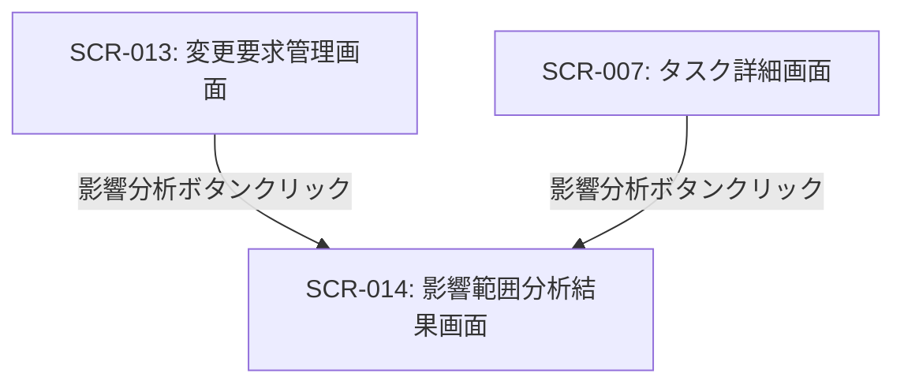

# ID: RDD-SCR-2025-014

# 画面: 影響範囲分析結果画面

## 画面概要

本画面は、特定の変更要求やタスクがシステム全体に与える影響範囲を視覚的に表示し、分析するための画面です。関連するタスク、成果物、機能、データモデルなどをグラフやツリー形式で示します。

### 画面遷移

### 画面レイアウト

- 中央に影響範囲を示すグラフまたはツリー構造のダイアグラム。
- ダイアグラムの要素（ノード）はタスク、成果物、機能、データモデルなどを表し、線（エッジ）は依存関係を示す。
- 画面上部に分析対象の変更要求またはタスクの概要。
- フィルタリングオプション（例: 影響度、種類）。
- 凡例。

### 入力項目

- 影響度フィルタ: ドロップダウン, [高/中/低],
  [全て], 任意, 表示する影響範囲の要素を影響度で絞り込む
- 種類フィルタ: 複数選択, [タスク, 成果物, 機能, データモデル],
  [全て], 任意, 表示する要素の種類を絞り込む

### 表示項目

- 影響範囲ダイアグラム: グラフ/ツリー形式, [なし], 影響範囲を視覚的に表現
- 分析対象概要: 文字列, [なし], 分析対象の変更要求またはタスクのタイトルとID
- 凡例: 文字列, [なし], ダイアグラムの各要素が何を表すかの説明

### 操作とイベント

- ダイアグラム要素クリック: 選択された要素の詳細情報（ポップアップまたはサイドバー）を表示。
- フィルタリングオプション変更: 選択されたフィルタに基づいてダイアグラムの表示を更新。
- ズームイン/アウト: ダイアグラムの表示倍率を変更。
- ドラッグ: ダイアグラムの表示位置を移動。

### エラーメッセージ

- [分析結果なし]: 「影響範囲を特定できませんでした。」, 画面中央にメッセージを表示

### 関連する機能要件

- FR-013 (影響範囲分析機能)

### 関連する業務フロー

- なし (情報分析)

### 関連するユースケース

- UC-011 (要求変更を管理し、影響範囲を確認する)
