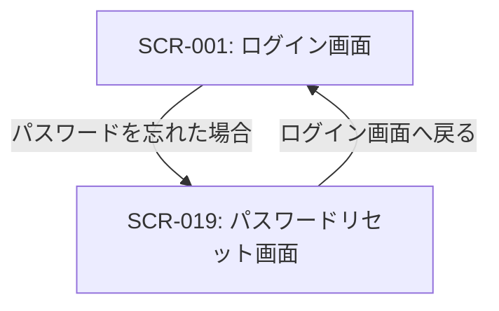

# ID: RDD-SCR-019

# 画面: パスワードリセット画面

## 画面概要

ユーザーがパスワードを忘れた際に、パスワードをリセットするための画面です。登録済みのメールアドレスにリセット用のリンクまたはコードを送信します。

### 画面遷移

### 画面レイアウト

- 中央にメールアドレス入力フォームと送信ボタンを配置。
- フォーム下部に「ログイン画面へ戻る」リンク。

### 入力項目

- メールアドレス: 文字列, [有効なメールアドレス形式],
  [なし], 必須, パスワードリセット用のメールアドレス

### 表示項目

- エラーメッセージ: 文字列,
  [赤字で表示], エラー発生時のメッセージ（例: 「登録されていないメールアドレスです。」）
- 完了メッセージ: 文字列,
  [緑字で表示], リセットメール送信完了時のメッセージ（例: 「パスワードリセットメールを送信しました。」）

### 操作とイベント

- 送信ボタンクリック: 入力されたメールアドレスを検証し、リセットメールを送信。成功時は完了メッセージを表示。失敗時はエラーメッセージを表示。
- 「ログイン画面へ戻る」リンククリック: SCR-001: ログイン画面へ遷移。

### エラーメッセージ

- [無効なメールアドレス]: 「登録されていないメールアドレスです。」, 画面上部にメッセージを表示
- [メール送信失敗]: 「メールの送信に失敗しました。時間をおいて再度お試しください。」, 画面上部にメッセージを表示

### 関連する機能要件

- FR-034 (パスワードリセット機能)

### 関連する業務フロー

- BF-007 (パスワードリセットフロー)

### 関連するユースケース

- UC-017 (パスワードをリセットする)
