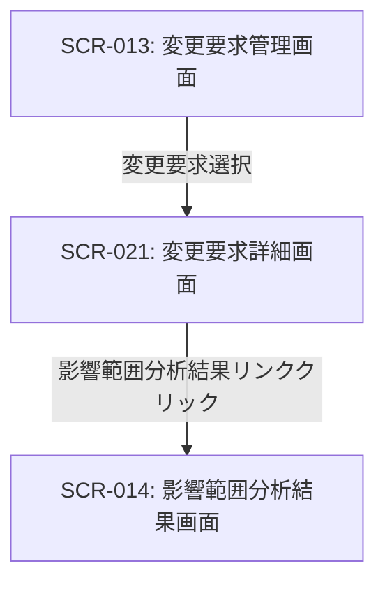

# ID: RDD-SCR-021

# 画面: 変更要求詳細画面

## 画面概要

システムに対する変更要求の詳細情報を表示し、管理するための画面です。変更要求の内容確認、承認フロー、進捗管理などを行います。

### 画面遷移

### 画面レイアウト

- 変更要求ID、タイトル、要求内容、要求者、要求日、ステータス、承認履歴などの基本情報が表示される。
- 「承認」ボタン、「却下」ボタン、コメント追加欄。
- 関連タスク一覧、影響範囲分析結果へのリンク。

### 入力項目

- ステータス: ドロップダウン,
  [承認待ち/承認済み/却下/完了], 必須, 変更要求の現在のステータス
- コメント: テキストエリア, [なし], [なし], 任意, 変更要求に関するコメント

### 表示項目

- 変更要求ID: 文字列, [なし], 変更要求を一意に識別するID
- タイトル: 文字列, [なし], 変更要求のタイトル
- 要求内容: テキストエリア, [なし], 変更要求の詳細内容
- 要求者: 文字列, [なし], 変更要求を提出したユーザー
- 要求日: 日時, [YYYY/MM/DD HH:MM], 変更要求が提出された日時
- ステータス: 文字列, [なし], 変更要求の現在のステータス
- 承認履歴: リスト形式, [なし], 承認者、承認日時、コメント

### 操作とイベント

- 「承認」ボタンクリック: 変更要求の承認、ステータス更新。
- 「却下」ボタンクリック: 変更要求の却下、ステータス更新。
- コメント入力後「追加」ボタンクリック: コメントを履歴に追加。
- 「影響範囲分析結果」リンククリック: SCR-014: 影響範囲分析結果画面へ遷移。

### エラーメッセージ

- [ステータス更新失敗]: 「ステータスの更新に失敗しました。再度お試しください。」, 画面上部にメッセージを表示

### 関連する機能要件

- FR-012 (要求変更管理機能)

### 関連する業務フロー

- なし (直接的な業務フローは存在しないが、変更管理の一部)

### 関連するユースケース

- UC-011 (要求変更を管理し、影響範囲を確認する)
