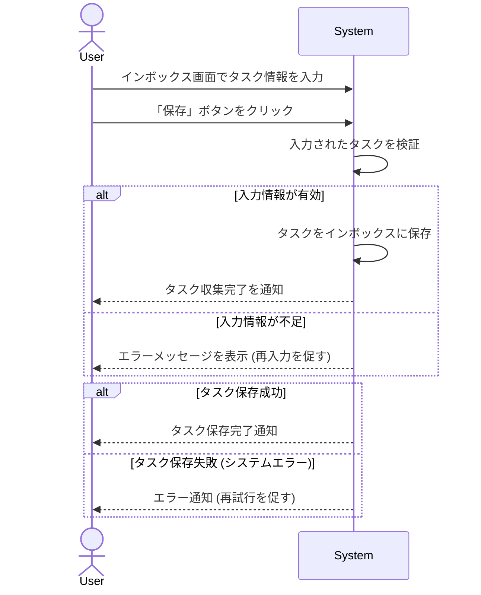

# ID: RDD-UCA-2025-001

# ユースケース: タスクをインボックスに記録する

## 概要

ユーザーが新しいタスクやアイデアを思いついた際に、Tas9s10reamのインボックスに迅速に記録します。

### アクター

- 主アクター: ACT-001 (ITプロジェクトメンバー)
- 副アクター: ACT-002 (ITプロジェクト管理者)

### 事前条件

- ユーザーがシステムにログインしていること。
- インボックス画面が表示されていること。

### 基本フロー

1. ユーザーはインボックス画面で新しいタスクのタイトル、詳細、期限などの情報を入力する。
1. ユーザーは「保存」ボタンをクリックする。
1. システムは入力されたタスクをインボックスに保存する。
1. システムはタスクの収集完了をユーザーに通知する。

### 代替フロー

- なし

### 例外フロー

- **入力情報不足**: ユーザーが必須項目（例: タイトル）を入力せずに保存しようとした場合、システムはエラーメッセージを表示し、再入力を促す。
- **システムエラー**: システムがタスクの保存に失敗した場合、システムはエラーを通知し、ユーザーは再試行できる。

### 事後条件

- 新しいタスクがインボックスに保存されていること。
- ユーザーにタスク保存完了の通知が表示されていること。

### 関連する機能要件

- FR-001 (タスク収集機能)
- FR-025 (ユーザー登録機能)

### 関連する業務フロー

- BF-001 (タスク収集フロー)

### 関連する画面

- SCR-002 (インボックス画面)
