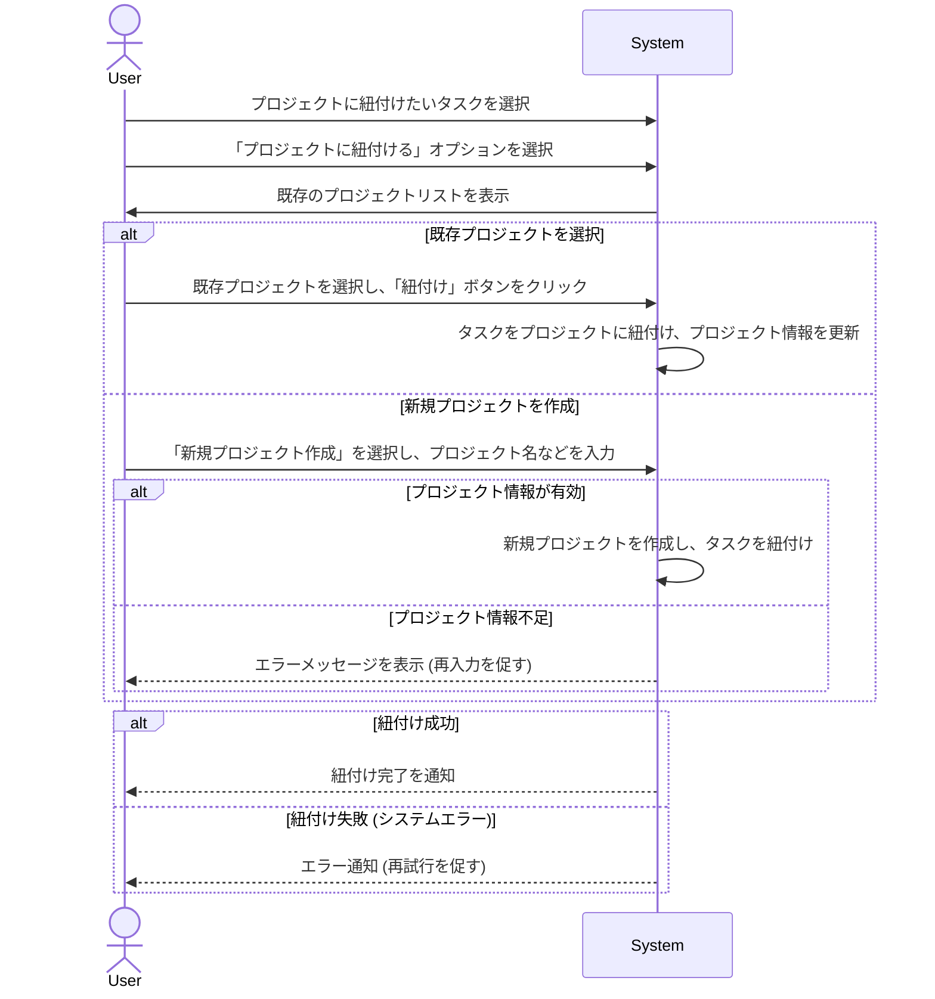

# ID: RDD-UCA-2025-003

# ユースケース: タスクをプロジェクトに紐付ける

## 概要

ユーザーがタスクを既存のプロジェクトに紐付けるか、新しいプロジェクトを作成して紐付けます。これにより、タスクがプロジェクトのコンテキストで管理されます。

### アクター

- 主アクター: ACT-001 (ITプロジェクトメンバー)
- 副アクター: ACT-002 (ITプロジェクト管理者)

### 事前条件

- ユーザーがシステムにログインしていること。
- プロジェクトに紐付けたいタスクが存在すること。

### 基本フロー

1. ユーザーはタスク詳細画面、またはインボックス処理画面から、プロジェクトに紐付けたいタスクを選択する。
1. ユーザーは「プロジェクトに紐付ける」オプションを選択する。
1. システムは既存のプロジェクトリストを表示する。
1. ユーザーは以下のいずれかの操作を行う。
   - 既存のプロジェクトを選択し、「紐付け」ボタンをクリックする。
   - 「新規プロジェクト作成」を選択し、プロジェクト名などの情報を入力して「作成＆紐付け」ボタンをクリックする。
1. システムはタスクをプロジェクトに紐付け、プロジェクト情報を更新する。
1. システムは紐付け完了をユーザーに通知する。

タスクをプロジェクトに紐付けるユースケースのシーケンスを示します。

### 代替フロー

- なし

### 例外フロー

- **プロジェクト情報不足**: 新規プロジェクト作成時に必須項目（例: プロジェクト名）が入力されていない場合、システムはエラーメッセージを表示し、入力を促す。
- **システムエラー**: システムがタスクの紐付けやプロジェクトの作成に失敗した場合、システムはエラーを通知し、ユーザーは再試行できる。

### 事後条件

- 選択されたタスクが指定されたプロジェクトに紐付けられていること。
- 新規プロジェクトが作成された場合、そのプロジェクトがシステムに登録されていること。
- ユーザーに紐付け完了の通知が表示されていること。

### 関連する機能要件

- FR-003 (タスク整理機能)
- FR-006 (プロジェクト管理機能)

### 関連する業務フロー

- BF-003 (タスク整理フロー)

### 関連する画面

- SCR-007 (タスク詳細画面)
- SCR-003 (プロジェクト一覧画面)
