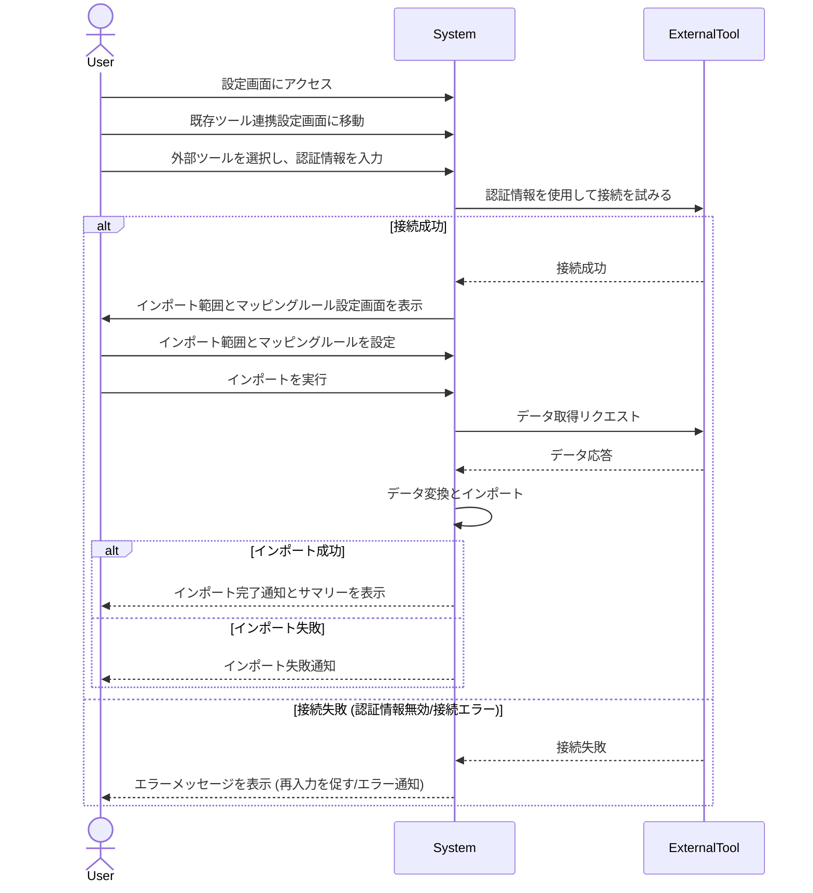

# ID: RDD-UCA-2025-006

# ユースケース: 既存ツールからタスクをインポートする

## 概要

ユーザーが既存のプロジェクト管理ツールやタスク管理ツールから、タスクや情報をTas9s10reamにインポートします。

### アクター

- 主アクター: ACT-002 (ITプロジェクト管理者)

### 事前条件

- ユーザーがシステムにログインしていること。
- 連携したい外部ツールのアカウント情報（APIキーなど）が準備されていること。

### 基本フロー

1. ユーザーは設定画面にアクセスし、既存ツール連携設定画面に移動する。
1. ユーザーは連携したい外部ツールを選択し、必要な認証情報（APIキーなど）を入力する。
1. システムは入力された認証情報を使用して外部ツールへの接続を試みる。
1. 接続が成功した場合、ユーザーはインポートしたいタスクやプロジェクトの範囲、マッピングルールを設定する。
1. ユーザーがインポートを実行する。
1. システムは外部ツールからデータを取得し、Tas9s10reamのデータモデルに合わせて変換し、インポートする。
1. システムはインポートの完了または失敗をユーザーに通知し、インポート結果のサマリーを表示する。

既存ツールからタスクをインポートするユースケースのシーケンスを示します。

### 代替フロー

- なし

### 例外フロー

- **認証情報無効**: 認証情報が無効な場合、システムはエラーメッセージを表示し、再入力を促す。
- **接続失敗**: 外部ツールとの接続に失敗した場合、システムはエラーを通知する。
- **データ変換エラー**: データ変換中にエラーが発生した場合、システムはエラーを通知し、問題のあるデータをスキップまたはログに記録する。

### 事後条件

- 外部ツールからのタスクがTas9s10reamにインポートされていること。
- インポート結果のサマリーがユーザーに表示されていること。

### 関連する機能要件

- FR-022 (既存ツール連携設定機能)
- FR-023 (タスクインポート機能)

### 関連する業務フロー

- BF-006 (既存ツール連携フロー)

### 関連する画面

- SCR-006 (設定画面)
- SCR-016 (既存ツール連携詳細設定画面)
