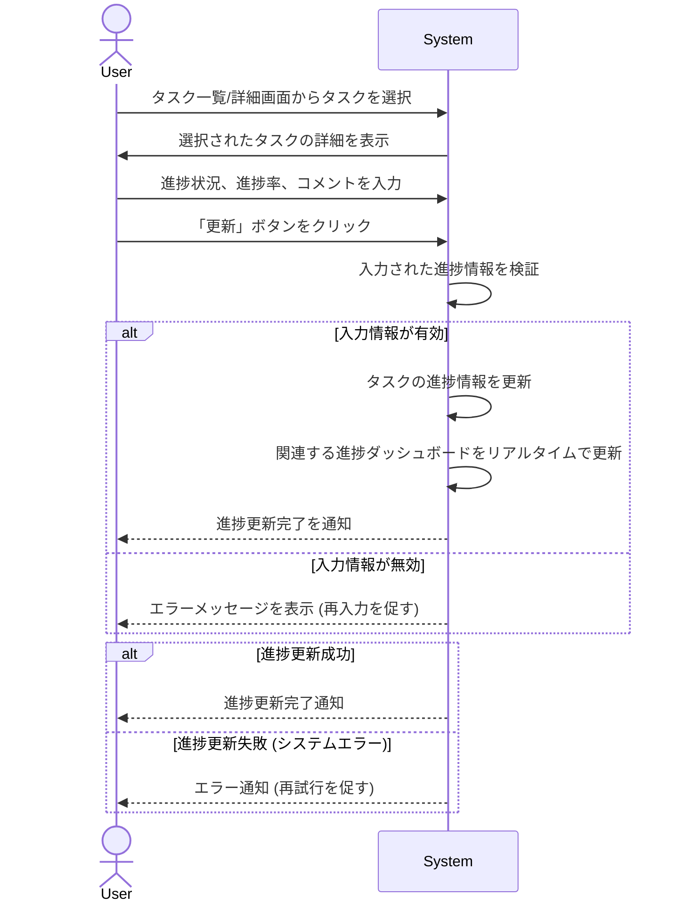

# ID: RDD-UCA-2025-007

# ユースケース: タスクの進捗を更新する

## 概要

ユーザーが自身のタスクの進捗状況をシステムに反映させます。これにより、プロジェクト全体の進捗がリアルタイムで更新されます。

### アクター

- 主アクター: ACT-001 (ITプロジェクトメンバー)

### 事前条件

- ユーザーがシステムにログインしていること。
- 更新したいタスクが存在すること。

### 基本フロー

1. ユーザーはタスク一覧画面、またはタスク詳細画面から、進捗を更新したいタスクを選択する。
1. システムは選択されたタスクの詳細を表示する。
1. ユーザーはタスクの進捗状況（例: 未着手、進行中、完了、中断など）を選択し、必要に応じて進捗率やコメントを入力する。
1. ユーザーは「更新」ボタンをクリックする。
1. システムはタスクの進捗情報を更新する。
1. システムは関連する進捗ダッシュボードをリアルタイムで更新する。
1. システムは進捗更新完了をユーザーに通知する。

### 代替フロー

- なし

### 例外フロー

- **入力情報無効**: 無効な進捗率が入力された場合、システムはエラーメッセージを表示し、再入力を促す。
- **システムエラー**: システムがタスクの進捗更新に失敗した場合、システムはエラーを通知し、ユーザーは再試行できる。

### 事後条件

- 選択されたタスクの進捗状況が更新されていること。
- 関連する進捗ダッシュボードが最新の状態に更新されていること。
- ユーザーに進捗更新完了の通知が表示されていること。

### 関連する機能要件

- FR-004 (タスク実行機能)
- FR-016 (進捗ダッシュボード表示機能)

### 関連する業務フロー

- BF-005 (タスク実行フロー)

### 関連する画面

- SCR-007 (タスク詳細画面)
