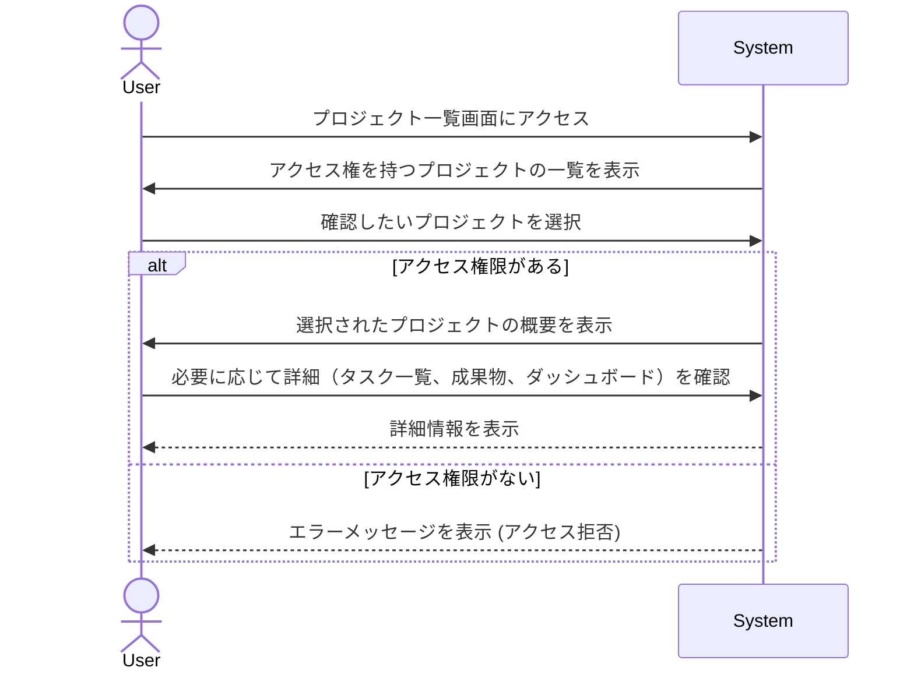

# ID: RDD-UCA-2025-008

# ユースケース: プロジェクトの状況を確認する

## 概要

ユーザーが担当する、または関連するプロジェクトの全体的な状況、進捗、および主要な情報を確認します。

### アクター

- 主アクター: ACT-001 (ITプロジェクトメンバー)
- 副アクター: ACT-002 (ITプロジェクト管理者)

### 事前条件

- ユーザーがシステムにログインしていること。
- 参照したいプロジェクトが存在すること。

### 基本フロー

1. ユーザーはプロジェクト一覧画面にアクセスする。
1. システムはユーザーがアクセス権を持つプロジェクトの一覧を表示する。
1. ユーザーは確認したいプロジェクトを選択する。
1. システムは選択されたプロジェクトの概要（進捗率、完了タスク数、未完了タスク数、期限、担当者、関連する成果物など）を表示する。
1. ユーザーは必要に応じて、プロジェクト内のタスク一覧、成果物一覧、または進捗ダッシュボードにドリルダウンして詳細を確認する。

### 代替フロー

- なし

### 例外フロー

- **アクセス権限なし**: ユーザーがアクセス権限を持たないプロジェクトを選択した場合、システムはエラーメッセージを表示し、アクセスを拒否する。
- **システムエラー**: システムがプロジェクト情報の取得に失敗した場合、システムはエラーを通知し、ユーザーは再試行できる。

### 事後条件

- ユーザーが選択したプロジェクトの状況を確認できること。

### 関連する機能要件

- FR-006 (プロジェクト管理機能)
- FR-016 (進捗ダッシュボード表示機能)

### 関連する業務フロー

- BF-003 (タスク整理フロー)
- BF-004 (週次レビューフロー)

### 関連する画面

- SCR-003 (プロジェクト一覧画面)
- SCR-009 (プロジェクト詳細画面)
- SCR-015 (リアルタイム進捗ダッシュボード画面)
