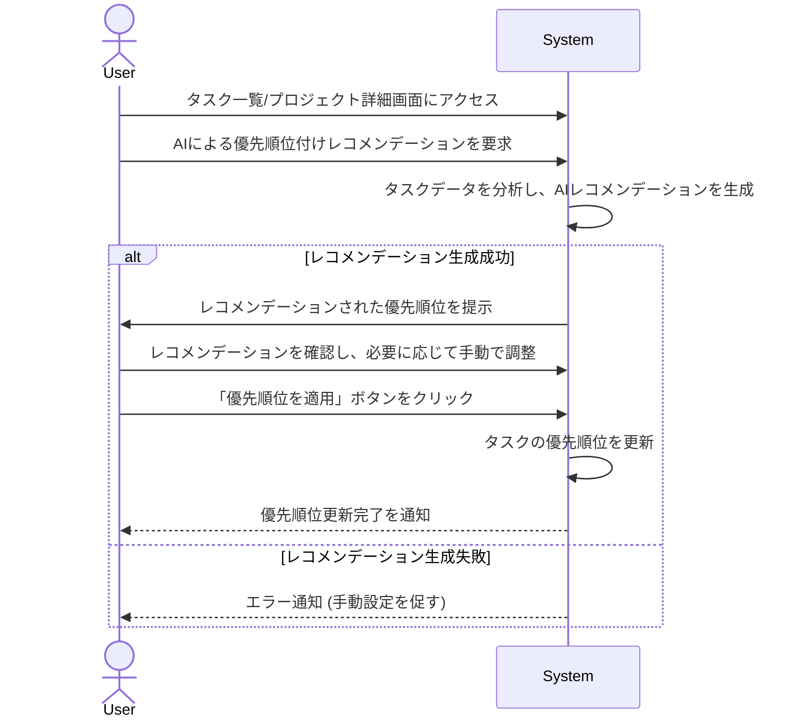

# ID: RDD-UCA-2025-009

# ユースケース: タスクの優先順位をAIのレコメンデーションに基づいて決定する

## 概要

ユーザーがAIによるタスクの優先順位付けレコメンデーションを受け取り、それに基づいてタスクの優先順位を決定します。

### アクター

- 主アクター: ACT-001 (ITプロジェクトメンバー)

### 事前条件

- ユーザーがシステムにログインしていること。
- 優先順位付けの対象となるタスクが存在すること。
- AIによる優先順位付け機能が有効になっていること。

### 基本フロー

1. ユーザーはタスク一覧画面、またはプロジェクト詳細画面にアクセスする。
1. ユーザーはAIによる優先順位付けレコメンデーションを要求する。
1. システムはタスクの期限、依存関係、重要度、ユーザーの過去の行動パターンなどを分析し、AIによる優先順位付けレコメンデーションを生成する。
1. システムはレコメンデーションされた優先順位をユーザーに提示する。
1. ユーザーはレコメンデーションを確認し、必要に応じて手動で優先順位を調整する。
1. ユーザーは「優先順位を適用」ボタンをクリックする。
1. システムはタスクの優先順位を更新する。
1. システムは優先順位更新完了をユーザーに通知する。

タスクの優先順位をAIのレコメンデーションに基づいて決定するユースケースのシーケンスを示します。

### 代替フロー

- なし

### 例外フロー

- **AIレコメンデーション生成失敗**:
  AIによる優先順位付けレコメンデーションの生成に失敗した場合、システムはエラーを通知し、ユーザーは手動で優先順位を設定できる。
- **システムエラー**: システムがタスクの優先順位更新に失敗した場合、システムはエラーを通知し、ユーザーは再試行できる。

### 事後条件

- タスクの優先順位がAIレコメンデーションまたはユーザーの手動調整に基づいて更新されていること。
- ユーザーに優先順位更新完了の通知が表示されていること。

### 関連する機能要件

- FR-008 (AIによるタスク優先順位付け機能)
- FR-003 (タスク整理機能)

### 関連する業務フロー

- BF-003 (タスク整理フロー)

### 関連する画面

- SCR-003 (プロジェクト一覧画面)
- SCR-009 (プロジェクト詳細画面)
- SCR-008 (検索画面)
