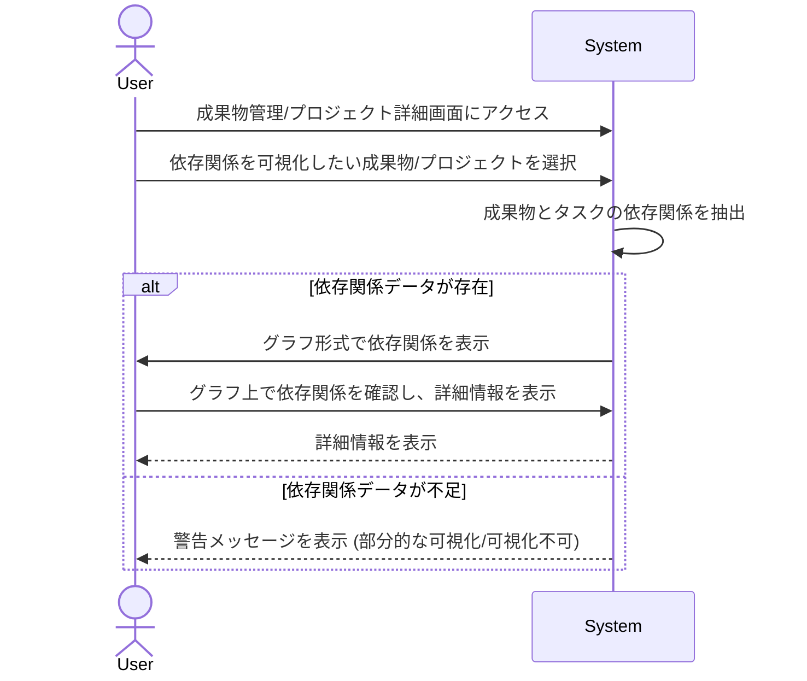

# ID: RDD-UCA-2025-010

# ユースケース: 成果物とタスクの依存関係を可視化する

## 概要

ユーザーがプロジェクト内の成果物と、それに関連するタスク間の依存関係を視覚的に確認します。これにより、プロジェクトの構造とボトルネックを把握しやすくなります。

### アクター

- 主アクター: ACT-001 (ITプロジェクトメンバー)
- 副アクター: ACT-002 (ITプロジェクト管理者)

### 事前条件

- ユーザーがシステムにログインしていること。
- 成果物とタスクがシステムに登録されており、関連付けられていること。

### 基本フロー

1. ユーザーは成果物管理画面、またはプロジェクト詳細画面にアクセスする。
1. ユーザーは依存関係を可視化したい成果物またはプロジェクトを選択する。
1. システムは選択された成果物と、それに依存するタスク、またはその成果物が依存するタスクを抽出し、グラフ形式で表示する。
1. ユーザーはグラフ上で依存関係を確認し、必要に応じて各要素（成果物、タスク）の詳細情報を表示する。

### 代替フロー

- なし

### 例外フロー

- **データ不足**: 依存関係情報が不足している場合、システムは警告メッセージを表示し、部分的な可視化を行うか、可視化できない旨を通知する。
- **システムエラー**: システムが依存関係の可視化に失敗した場合、システムはエラーを通知し、ユーザーは再試行できる。

### 事後条件

- 成果物とタスクの依存関係が視覚的に表示されていること。

### 関連する機能要件

- FR-011 (成果物依存関係可視化機能)
- FR-009 (成果物管理機能)
- FR-010 (タスク依存関係管理機能)

### 関連する業務フロー

- BF-003 (タスク整理フロー)

### 関連する画面

- SCR-012 (成果物管理画面)
- SCR-009 (プロジェクト詳細画面)
