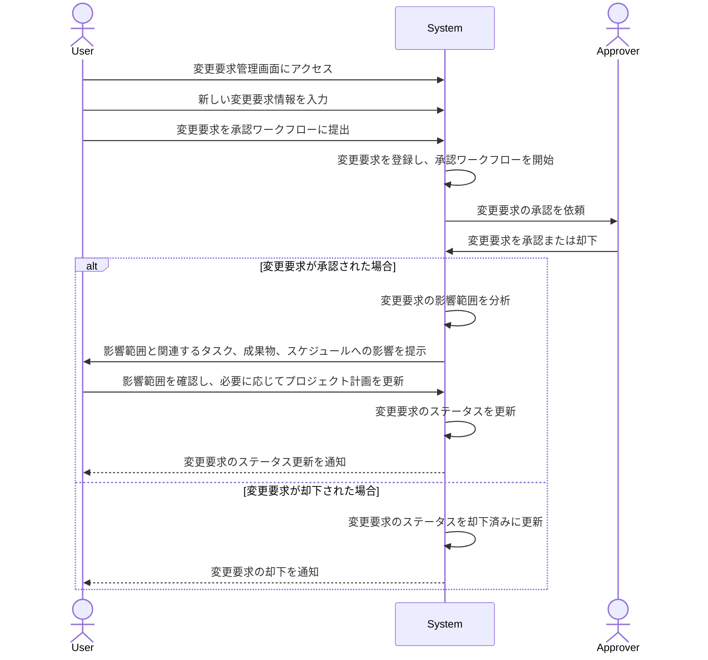

# ID: RDD-UCA-2025-011

# ユースケース: 要求変更を管理し、影響範囲を確認する

## 概要

ITプロジェクト管理者が、プロジェクトに対する要求変更を登録、承認ワークフローを管理し、その変更がプロジェクト全体に与える影響範囲を分析します。

### アクター

- 主アクター: ACT-002 (ITプロジェクト管理者)

### 事前条件

- ユーザーがシステムにログインしていること。
- 変更要求を登録するための情報が準備されていること。

### 基本フロー

1. ユーザーは変更要求管理画面にアクセスする。
1. ユーザーは新しい変更要求を登録するため、変更内容、理由、提案者、緊急度などの情報を入力する。
1. ユーザーは変更要求を承認ワークフローに提出する。
1. システムは変更要求を登録し、承認ワークフローを開始する。
1. 承認者が変更要求を承認または却下する。
1. 承認された場合、システムは変更要求の影響範囲を分析し、関連するタスク、成果物、スケジュールへの影響を提示する。
1. ユーザーは影響範囲を確認し、必要に応じてプロジェクト計画を更新する。
1. システムは変更要求のステータス更新をユーザーに通知する。

### 代替フロー

- なし

### 例外フロー

- **入力情報不足**: 変更要求登録時に必須項目が入力されていない場合、システムはエラーメッセージを表示し、入力を促す。
- **影響範囲分析失敗**: システムが影響範囲分析に失敗した場合、システムはエラーを通知し、ユーザーは手動で影響範囲を評価できる。
- **システムエラー**: システムが変更要求の登録やステータス更新に失敗した場合、システムはエラーを通知し、ユーザーは再試行できる。

### 事後条件

- 変更要求がシステムに登録され、承認ワークフローが開始されていること。
- 承認された変更要求の場合、その影響範囲が分析され、ユーザーに提示されていること。

### 関連する機能要件

- FR-012 (要求変更管理機能)
- FR-013 (影響範囲分析機能)

### 関連する業務フロー

- BF-004
  (週次レビューフロー) - プロジェクトマネージャーがレビュー時に変更要求を確認する可能性があるため

### 関連する画面

- SCR-013 (変更要求管理画面)
- SCR-014 (影響範囲分析結果画面)
- SCR-021 (変更要求詳細画面)
