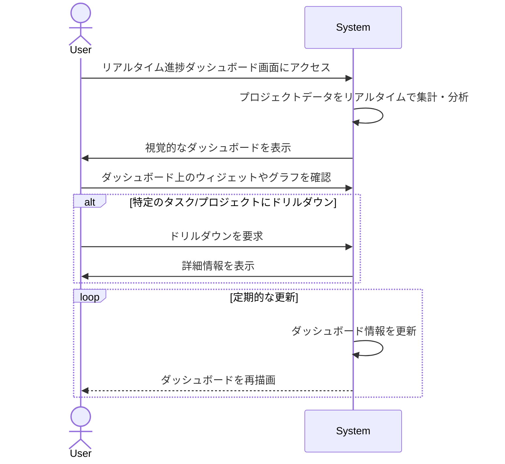

# ID: RDD-UCA-2025-012

# ユースケース: リアルタイム進捗ダッシュボードでプロジェクト状況を把握する

## 概要

ITプロジェクト管理者が、リアルタイムで更新される進捗ダッシュボードを通じて、プロジェクト全体の状況、ボトルネック、遅延リスクなどを一目で把握します。

### アクター

- 主アクター: ACT-002 (ITプロジェクト管理者)

### 事前条件

- ユーザーがシステムにログインしていること。
- プロジェクトデータがシステムに登録され、タスクの進捗が更新されていること。

### 基本フロー

1. ユーザーはリアルタイム進捗ダッシュボード画面にアクセスする。
1. システムはプロジェクト全体の進捗状況、各タスクのステータス、ボトルネック、遅延リスク、リソース配分状況などをリアルタイムで集計・分析し、視覚的に表示する。
1. ユーザーはダッシュボード上の各ウィジェットやグラフを確認し、プロジェクトの健全性を評価する。
1. ユーザーは必要に応じて、特定のタスクやプロジェクトにドリルダウンして詳細情報を確認する。
1. システムは定期的にダッシュボードの情報を更新する。

リアルタイム進捗ダッシュボードでプロジェクト状況を把握するユースケースのシーケンスを示します。

### 代替フロー

- なし

### 例外フロー

- **データ取得失敗**: システムがリアルタイムデータの取得や分析に失敗した場合、システムはエラーを通知し、一部または全てのダッシュボード情報が表示されない可能性がある。
- **システムエラー**: システムがダッシュボードの表示に失敗した場合、システムはエラーを通知し、ユーザーは再試行できる。

### 事後条件

- ユーザーがリアルタイム進捗ダッシュボードを通じてプロジェクトの状況を把握できること。

### 関連する機能要件

- FR-014 (リアルタイム進捗データ収集機能)
- FR-015 (リアルタイム進捗データ分析機能)
- FR-016 (進捗ダッシュボード表示機能)
- FR-017 (ボトルネック・遅延リスク特定機能)

### 関連する業務フロー

- BF-004
  (週次レビューフロー) - プロジェクトマネージャーがレビュー時にダッシュボードを確認する可能性があるため

### 関連する画面

- SCR-015 (リアルタイム進捗ダッシュボード画面)
