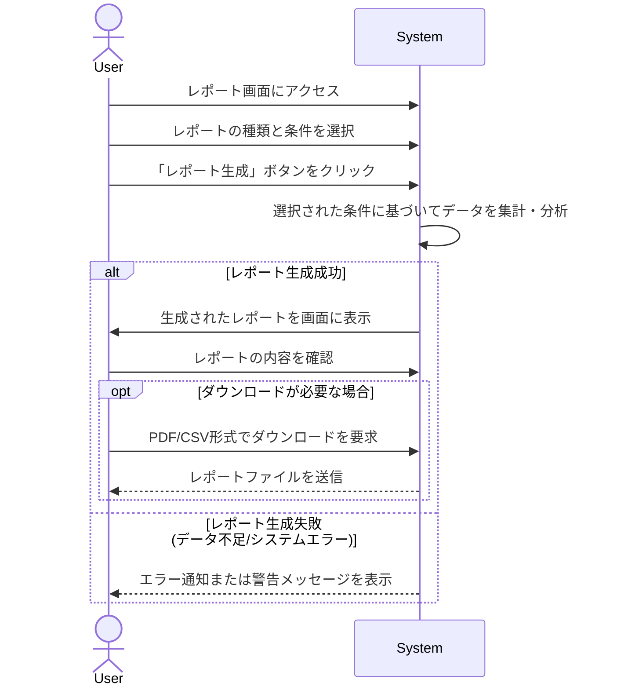

# ID: RDD-UCA-2025-016

# ユースケース: レポートを生成・閲覧する

## 概要

ITプロジェクト管理者が、プロジェクトの進捗、タスク履歴、リソース利用状況などに関するレポートを生成し、閲覧します。

### アクター

- 主アクター: ACT-002 (ITプロジェクト管理者)

### 事前条件

- ユーザーがシステムにログインしていること。
- レポート生成に必要なデータがシステムに存在すること。

### 基本フロー

1. ユーザーはレポート画面にアクセスする。
1. ユーザーは生成したいレポートの種類（例: 進捗レポート、タスク履歴レポート、リソース利用レポート）と期間、対象プロジェクトなどの条件を選択する。
1. ユーザーは「レポート生成」ボタンをクリックする。
1. システムは選択された条件に基づいてデータを集計・分析し、レポートを生成する。
1. システムは生成されたレポートを画面に表示する。
1. ユーザーはレポートの内容を確認し、必要に応じてPDFやCSV形式でダウンロードする。

### 代替フロー

- なし

### 例外フロー

- **データ不足**: レポート生成に必要なデータが不足している場合、システムは警告メッセージを表示し、部分的なレポートを生成するか、生成できない旨を通知する。
- **システムエラー**: システムがレポートの生成に失敗した場合、システムはエラーを通知し、ユーザーは再試行できる。

### 事後条件

- 選択された条件に基づいてレポートが生成され、画面に表示されていること。

### 関連する機能要件

- FR-018 (レポート生成機能)
- FR-032 (進捗レポート出力機能)
- FR-033 (タスク履歴レポート出力機能)

### 関連する業務フロー

- なし (直接的な業務フローは存在しないが、プロジェクト管理の運用に寄与)

### 関連する画面

- SCR-011 (レポート画面)
