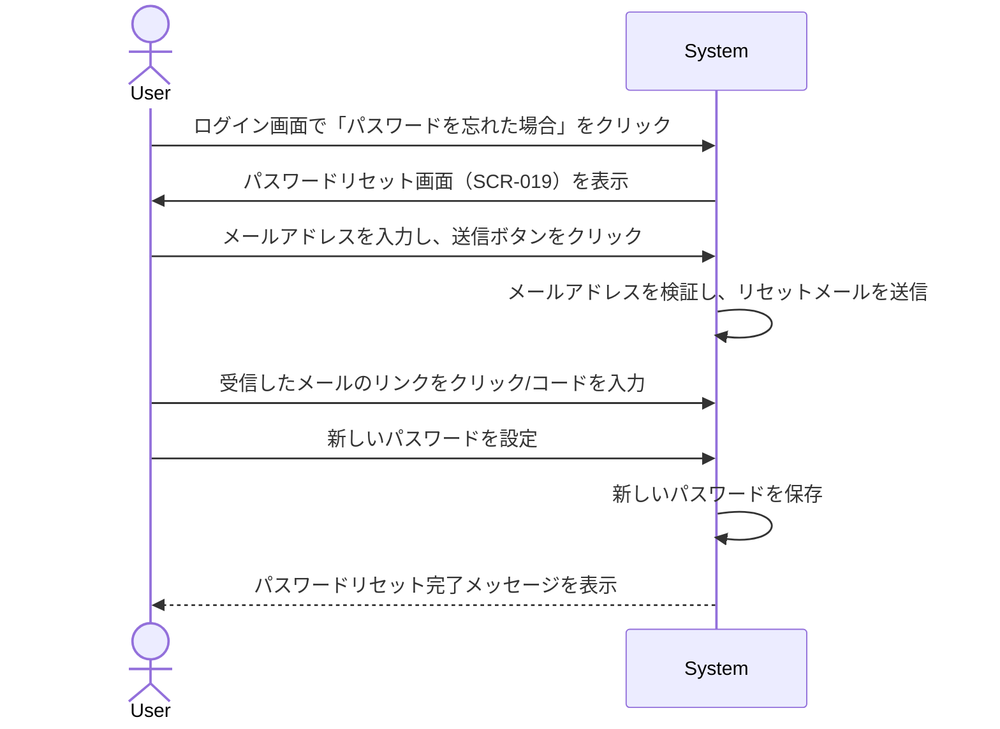

# ID: RDD-UCA-2025-017

# ユースケース: パスワードをリセットする

## 概要

ユーザーがパスワードを忘れた際に、登録済みのメールアドレスを利用してパスワードを再設定します。

### アクター

- 主アクター: ユーザー

### 事前条件

- ユーザーがシステムに登録されていること。
- ユーザーがログイン画面にアクセスできること。

### 基本フロー

1. ユーザーはログイン画面（SCR-001）で「パスワードを忘れた場合」リンクをクリックする。
1. システムはパスワードリセット画面（SCR-019）を表示する。
1. ユーザーは登録済みのメールアドレスを入力し、送信ボタンをクリックする。
1. システムは入力されたメールアドレスを検証し、パスワードリセット用のリンクまたはコードをユーザーのメールアドレスに送信する。
1. ユーザーは受信したメール内のリンクをクリックするか、コードを入力して新しいパスワードを設定する。
1. システムは新しいパスワードを保存し、パスワードリセット完了のメッセージを表示する。

### 代替フロー

- なし

### 例外フロー

- **メールアドレス未登録**: 入力されたメールアドレスがシステムに登録されていない場合、システムはエラーメッセージを表示する。
- **メール送信失敗**: システムがリセットメールの送信に失敗した場合、システムはエラーメッセージを表示する。
- **リンクの有効期限切れ**: リセットリンクの有効期限が切れている場合、システムはエラーメッセージを表示し、再度のリセット手続きを促す。

### 事後条件

- ユーザーが新しいパスワードを設定し、ログインできる状態になっていること。

### 関連する機能要件

- [機能ID: FR-XXX]

### 関連する業務フロー

- BF-007 (パスワードリセットフロー)

### 関連する画面

- SCR-001 (ログイン画面)
- SCR-019 (パスワードリセット画面)
