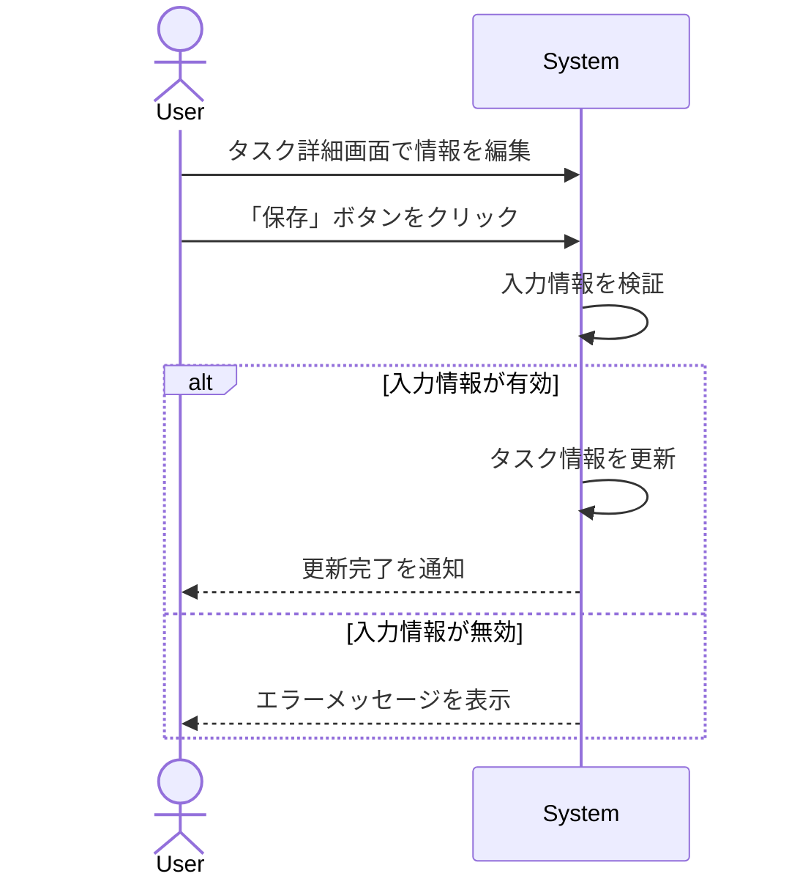

# ID: RDD-UCA-2025-018

# ユースケース: タスク詳細を編集する

## 概要

ユーザーがタスクの優先順位、コンテキスト、期限、メモ、添付ファイルなどの詳細情報を編集します。

### アクター

- 主アクター: ACT-001 (ITプロジェクトメンバー)
- 副アクター: ACT-002 (ITプロジェクト管理者)

### 事前条件

- ユーザーがシステムにログインしていること。
- 編集したいタスクが存在すること。

### 基本フロー

1. ユーザーはタスク詳細画面で、編集したい項目（優先順位、コンテキスト、期限、メモ、添付ファイル）を変更します。
1. ユーザーは「保存」ボタンをクリックします。
1. システムは変更されたタスク情報を保存します。
1. システムはタスクの更新完了をユーザーに通知します。

タスク詳細を編集するユースケースのシーケンスを示します。

### 代替フロー

- なし

### 例外フロー

- **入力情報無効**: ユーザーが無効な情報（例: 不正な日付形式）を入力した場合、システムはエラーメッセージを表示し、再入力を促します。
- **システムエラー**: システムがタスク情報の更新に失敗した場合、システムはエラーを通知し、ユーザーは再試行できます。

### 事後条件

- タスクの詳細情報が更新されていること。

### 関連する機能要件

- FR-003 (タスク整理機能)

### 関連する業務フロー

- BF-003 (タスク整理フロー)

### 関連する画面

- SCR-007 (タスク詳細画面)
