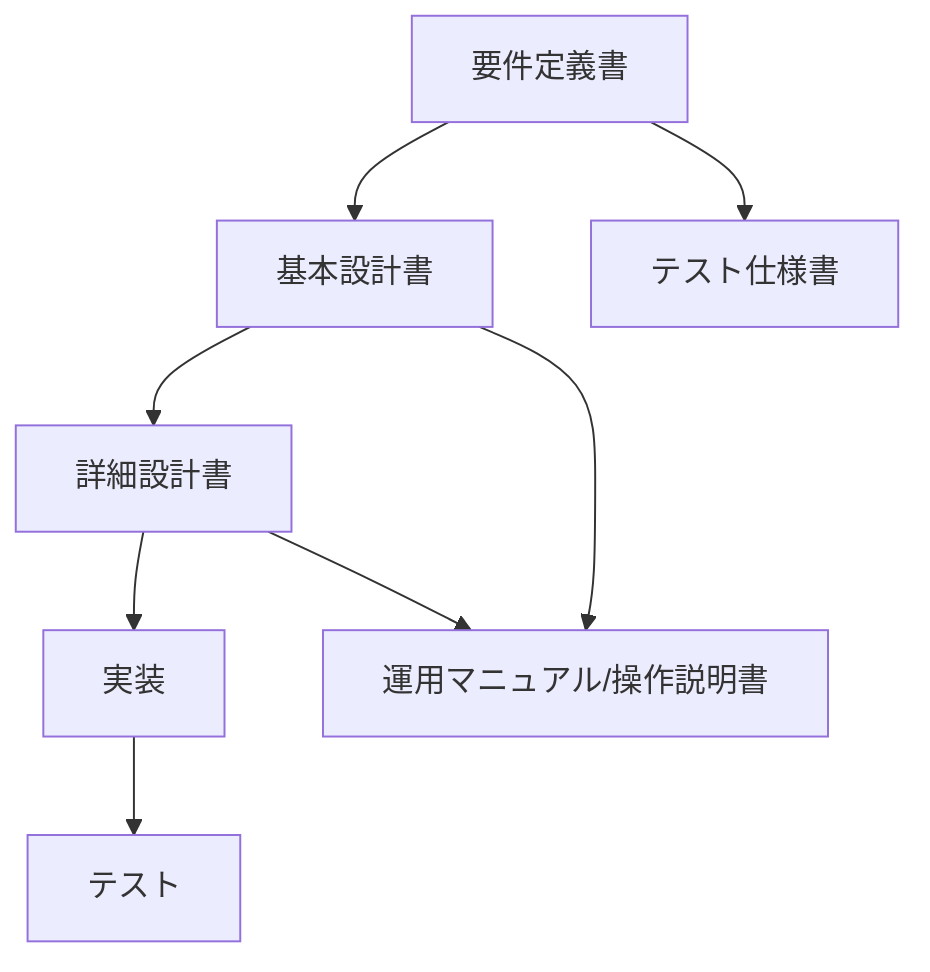

# ソフトウェア開発ドキュメント作成ルール

本ドキュメントは、ソフトウェア開発におけるドキュメントの種類、詳細な説明、依存関係、および作成フローに関する基本的なルールを定めます。

## 1. ドキュメントの種類と内容

プロジェクトで作成される主要なドキュメントは以下の通りです。

### 1.1. 要件定義書

システムに求められる機能や条件を明確化し、顧客やユーザーの要求をまとめるドキュメントです。システムが満たすべき要求条件を具体化します。

**記述の要点**: 要件定義書はシステム開発の初期段階で作成され、システム全体像や目的を明確にするためのドキュメントです。技術的な詳細は基本設計以降で詰めるため、ここでは過剰な詳細化は避けます。クライアントと開発側双方が共通理解できるよう、曖昧な表現を避け、具体的かつ数値目標や条件を盛り込んで記述します。

- **システム開発の目的・背景**: なぜこのシステムを開発するのか、その目的と背景を明確にします。
- **業務のフロー**: 現状業務および新システム導入後の業務フローを定義します（業務フロー図など）。
- **システムの利用者の一覧**: システムを利用するアクター（利用者、外部システムなど）を定義します。
- **利用者とシステムの相互作用**: ユースケース図やユースケース記述などで、利用者がシステムとどのように関わるかを詳細に記述します。
- **必要な画面や機能**: システムが提供すべき機能の一覧、画面の概要、入出力項目などを定義します。機能要件はユーザー操作や業務フローに基づき、具体的かつ実現可能な範囲で詳細化します。
- **非機能要件**: システムの性能（応答速度、処理能力など）、可用性（稼働時間、障害時の復旧目標など）、セキュリティ、保守性などを定義します。数値目標や具体的な条件を盛り込みます。
- **制約条件や品質要求**: システム開発における制約事項（技術的制約、法的制約など）や、品質に関する要求事項を明確にします。
- **用語定義**: 社内用語や業界用語など、ドキュメント内で使用される専門用語を定義し、共通理解を促進します。
- **スケジュール・予算情報**: プロジェクトのスケジュールや予算に関する情報も併せて明示することが望ましいです。

### 1.2. 基本設計書 (外部設計書)

要件定義書に基づき、システム全体の構造や外部仕様を定義するドキュメントです。要件定義から具体化し、「何をどう作るか」を示します。

**記述の要点**: 基本設計書は、要件定義で決まった内容を具体的なシステム形態に落とし込む段階であり、ユーザー視点の機能仕様や画面項目・操作方法などを明確に記述します。システム全体像を示す概要レベルから具体的な動作レベルまで複数段階の粒度で記述し、抽象度の異なる図表を使い分けます。開発チームが実装するための指針となるだけでなく、クライアントとの合意形成文書でもあるため、誰が読んでも誤解がないように、具体的かつ簡潔に記述することが求められます。

- **システム概要**: システム全体の構成、アーキテクチャ、主要なサブシステム間の連携などを記述します。システム構成図などを含みます。
- **機能一覧**: システムが提供する機能の全体像を一覧化し、各機能の概要を記述します。
- **画面設計**: ユーザーインターフェースのレイアウト、画面遷移、入力項目、表示項目、操作方法などを詳細に設計します。画面遷移図、画面レイアウト図などを含みます。
- **帳票設計**: システムが出力する帳票のレイアウト、出力項目、出力条件などを設計します。
- **データベース設計**: データベースの論理構造（エンティティ、属性、リレーションシップ）を設計します。ER図などを含みます。
- **外部インターフェース設計**: 外部システムとの連携方法、データ形式、通信プロトコルなどを設計します。
- **バッチ処理設計**: 定期的に実行されるバッチ処理の概要、処理内容、スケジュールなどを設計します。
- **セキュリティ設計**: 認証、認可、データ保護など、システム全体のセキュリティに関する設計を記述します。

### 1.3. 詳細設計書 (内部設計書)

基本設計書をさらにブレークダウンし、個々のプログラムの内部仕様を定義するドキュメントです。基本設計からさらに技術的な実装レベルまで落とし込みます。

**記述の要点**: 詳細設計書は、基本設計で定義したシステム全体像を基に、実際にプログラムを書くための具体的な仕様を決める工程で作成されます。内部処理の流れやアルゴリズム、データベーステーブル構造、クラス・メソッド設計など非常に細かい部分まで記述する必要があります。視覚的な図も用いて処理フローを細分化し、開発者が理解しやすいよう粒度調整することもあります。曖昧な表現は誤解や実装ミスにつながるため避け、具体的な数値や条件を示すことが求められます。専門用語を使いつつも視覚的に見やすく整理し、不明瞭さによる認識ズレを防ぐ工夫も必要です。

- **プログラム構成**: 各プログラムの役割、構成要素（クラス、モジュール、関数など）を定義します。
- **処理フロー**: 各機能における内部処理の流れを詳細に記述します。シーケンス図、アクティビティ図、フローチャートなどを用いて視覚的に表現します。
- **アルゴリズム**: 複雑な処理や計算ロジックについて、具体的なアルゴリズムを記述します。
- **データ構造**: プログラム内で使用するデータ構造（クラスのプロパティ、変数の型など）を詳細に定義します。
- **データベース物理設計**: データベースのテーブル構造、カラム定義、インデックス、制約などを物理レベルで定義します。
- **エラー処理**: 各処理におけるエラー発生時の挙動、エラーメッセージ、ログ出力などを詳細に定義します。
- **入出力インターフェース**: プログラム間のデータの受け渡し方法、APIの呼び出し規約などを詳細に定義します。
- **外部ライブラリ/フレームワークの使用**: 使用する外部ライブラリやフレームワーク、そのバージョン、使用方法に関する詳細を記述します。
- **最新情報の反映と更新**: 技術トレンドや業界標準の変化に対応し、新しいアルゴリズムやツールの情報を取り入れて信頼性向上につなげます。定期的な見直しにより常に最適状態を維持します。

### 1.4. APIドキュメント

APIのエンドポイント、パラメーター、レスポンス例など、APIの利用方法を説明するリファレンスやチュートリアルです。

**記述の要点**:
APIドキュメントは、読み手（開発者や他のシステム）が迷わず理解・利用できるように、具体的かつ適切な粒度で記述する必要があります。抽象的な表現ではなく、具体的な指示や説明を盛り込むことで、実装者や利用者が混乱せずスムーズに理解できるようになります。不明瞭な表現や曖昧さを排除し、誰でも理解できる文章構成が求められます。網羅性、正確性、わかりやすさのバランスを考慮し、目的によってどこを重視するかを明確にします。機能要件だけでなく、性能、信頼性、保守性など非機能要件についても具体的な数値目標などを設定し、カテゴリ別に整理するとよいでしょう。

- **エンドポイント**: 各APIのエンドポイントURL、HTTPメソッド（GET,
  POSTなど）を明確に記述します。
- **パラメーター**: 各APIが受け取るリクエストパラメーター（必須/任意、データ型、制約、説明）を詳細に記述します。
- **レスポンス**: 各APIが返すレスポンスの構造、データ型、各フィールドの説明、成功/エラー時のレスポンス例を記述します。
- **認証・認可**:
  APIへのアクセスに必要な認証・認可の仕組み（APIキー、OAuthなど）と、その利用方法を記述します。
- **エラーコード**:
  APIが返す可能性のあるエラーコードとその意味、対応方法を記述します。
- **利用例**: 各APIの具体的な利用例（リクエストとレスポンスのサンプルコード）を提供します。
- **バージョン管理**:
  APIのバージョン情報と、バージョン間の変更点（破壊的変更など）を明確に記述します。
- **非機能要件**: 性能（応答速度、スループット）、信頼性、セキュリティなど、APIに関する非機能要件を記述します。

### 1.5. テスト仕様書/報告書

システムやプログラムのテストに関するドキュメントです。システムが要件通りに動作するかを確認するための計画や条件を詳細に記載し、実施したテスト結果および評価をまとめます。

**記述の要点**: テスト仕様書は、テスト計画やテスト条件が具体的かつ抜け漏れなく明示される必要があります。細かい単位でテストケースを設計し、どの機能・条件をどう検証するかを明確に示すことが求められます。誰が見ても理解できるように、用語定義や前提条件も含めて具体的でわかりやすく記述されるべきです。テスト報告書は、実施した各テストケースごとの結果を詳細に報告し、問題点やリスクも含めて具体的な情報提供が必要です。関係者間で認識齟齬なく共有できるよう、進捗状況・障害情報・リスク対応策なども整理して分かりやすくまとめられることが望ましいです。

- **テスト仕様書**:
  - **テスト目的**: テストの目的と範囲を明確にします。
    - **テスト対象**: テストの対象となるシステム、機能、モジュールを特定します。
    - **テスト環境**: テストを実施する環境（OS、ミドルウェア、バージョンなど）を記述します。
    - **テスト観点**: テストの視点（機能テスト、性能テスト、セキュリティテストなど）を明確にします。
    - **テストケース**: 各機能や要件に対応するテストケースを詳細に記述します。テスト項目、テスト手順、入力データ、期待結果、合否判定基準を含みます。
    - **テストデータ**: テストに使用するデータの準備方法や内容を記述します。
    - **テストスケジュール**: テストの実施期間、担当者、進捗管理方法を記述します。
- **テスト報告書**:
  - **テスト概要**: テストの目的、期間、対象、実施結果の概要を記述します。
    - **テスト結果サマリ**: テストケースの実行数、合格数、不合格数、未実施数などを集計し、全体的なテストの進捗と品質を評価します。
    - **不具合一覧**: 発見された不具合の詳細（発生条件、再現手順、影響範囲、重要度、担当者、ステータスなど）を一覧化します。
    - **品質評価**: テスト結果に基づき、システムの品質を評価し、リリース可否の判断材料を提供します。
    - **課題と対策**: テスト中に発生した課題やリスク、それらに対する対策を記述します。
    - **今後の計画**: 残存する不具合や未実施テストに対する今後の計画を記述します。

### 1.6. リリースノート

新機能追加やバグ修正内容など、アップデート情報を記載するドキュメントです。

**記述の要点**: リリースノートでは、変更点を細かく書きすぎると情報過多でユーザーが混乱しやすくなり、一方でざっくりしすぎると具体的な影響やメリットが伝わりにくいという問題があります。適切な粒度としては、「ユーザーが理解しやすい範囲で、かつ作業単位として管理可能なレベル」が望ましいです。新機能追加なら「何を追加したか」、バグ修正なら「どんな不具合を直したか」を簡潔に示します。技術的な内容でも専門用語だけでなく、「ユーザーにどんなメリットがあるのか」を意識して説明することが評価されます。論理的に項目を整理し、重要事項は箇条書きなど見やすい形式でまとめることで読み手の理解を助けます。不明瞭な表現は避けて誰でも追いやすい文章構成にするべきです。

- **バージョン情報**: リリースされるソフトウェアのバージョン番号、リリース日を明確に記載します。
- **新機能**: 追加された新機能について、その概要とユーザーにとってのメリットを記述します。
- **改善点**: 既存機能の改善点や変更点について、具体的に記述します。
- **不具合修正**: 修正された不具合の内容と、それが解決した問題点を記述します。
- **既知の不具合**: 現在認識されている未解決の不具合や制限事項について記述します。
- **注意事項**: アップデートに伴う注意点や、ユーザーが行うべき作業（例: データ移行、設定変更）を記述します。
- **謝辞**: 貢献者や協力者への謝辞を記載することもあります。

### 1.7. 運用マニュアル/操作説明書

システム稼働後の運用および利用者向けのドキュメントです。システム運用時のミス防止を目的とし、特定業務に特化した内容で構成されます。

**記述の要点**: 記述する各要素の情報量や詳細レベルを均一に保つことで、全体として統一感が生まれ、読み手が業務全体の流れを把握しやすくなります。操作手順や業務フローは開始・終了点、分岐条件、時系列などをはっきり示すことが求められます。これにより複雑な処理も理解しやすくなり、ミス防止につながります。一目で重要ポイントがわかるよう視覚的工夫も効果的です。冗長にならず誰でも誤解なく理解できる文章であることが重要です。詳細説明は別途マニュアル化し、本書では操作手順など主要事項のみ簡潔明瞭にまとめる方法も有効です。

- **運用マニュアル**:
  - **システム概要**: 運用対象システムの概要、構成、役割を記述します。
    - **運用手順**: システムの起動・停止、バックアップ、データ復旧、ログ管理、定期メンテナンスなどの手順を詳細に記述します。
    - **監視項目と対応**: システムの監視項目（CPU使用率、メモリ使用量、ディスク容量など）と、異常を検知した際の対応手順を記述します。
    - **障害対応フロー**: 障害発生時の連絡体制、切り分け手順、復旧手順、エスカレーションルールなどを明確に記述します。
    - **セキュリティ運用**: セキュリティパッチ適用、アクセスログ監視、不正アクセス対策などの運用手順を記述します。
    - **構成管理**: システムの構成情報（サーバー、ミドルウェア、アプリケーションなど）の管理方法を記述します。
- **操作説明書**:
  - **システム概要**: 利用者向けのシステムの概要と、提供される機能の全体像を記述します。
    - **ログイン・ログアウト**: システムへのログイン方法、ログアウト方法を記述します。
    - **基本操作**: 画面の構成、メニューの操作、データの入力・参照・更新・削除など、基本的な操作手順を記述します。
    - **機能別操作**: 各機能の具体的な操作手順を、画面イメージや図を用いて分かりやすく記述します。
    - **エラーメッセージと対処**: システムが表示するエラーメッセージとその意味、利用者が行うべき対処方法を記述します。
    - **FAQ**: よくある質問とその回答をまとめます。
    - **問い合わせ先**: システムに関する問い合わせ先を明記します。

## 2. ドキュメント間の依存関係

ドキュメントは、開発フェーズが進むにつれて詳細化され、前のフェーズのドキュメントに依存します。

- **要件定義 → 基本設計 → 詳細設計 → 実装 → テスト**
  の流れでドキュメントが段階的に作成されます。
- **要件定義書**は、すべての設計ドキュメント（基本設計書、詳細設計書）およびテスト仕様書の基礎となります。
- **基本設計書**は、要件定義書の内容を具体化し、詳細設計書の基盤となります。
- **詳細設計書**は、基本設計書の内容をさらに掘り下げ、実装の直接的な指針となります。
- **テスト仕様書**は、要件定義書や設計書に基づいて作成され、システムの要件が満たされているかを確認します。
- **運用マニュアル/操作説明書**は、設計されたシステムの機能や操作方法に基づいて作成されます。

## 3. ドキュメント作成フロー

ドキュメント作成は、ソフトウェア開発ライフサイクル（SDLC）の各フェーズと連携して進められます。

1. **プロジェクトの目的と範囲の明確化**: プロジェクトの目的と範囲を明確にし、必要なドキュメントの種類を決定します。

2. **ドキュメントの種類と構成の計画**: プロジェクトの特性や規模に応じて、作成するドキュメントの種類と構成を計画します。

3. **フェーズごとの作成**:

- **要件定義フェーズ**: 要件定義書を作成します。
- **設計フェーズ**: 基本設計書、詳細設計書を作成します。
- **実装フェーズ**: 必要に応じてプログラム設計書やコードコメントなどを記述します。
- **テストフェーズ**: テスト仕様書を作成し、テスト実施後にテスト報告書を作成します。
- **運用・保守フェーズ**: 運用マニュアル、操作説明書などを作成します。

1. **レビューと承認**: 作成されたドキュメントは、関係者間でレビューされ、内容の正確性と網羅性が確認された上で承認されます。

2. **更新とメンテナンス**: 開発の進行に伴う仕様変更や、システム稼働後の改修などにより、ドキュメントは常に最新の状態に保つ必要があります。

3. **ツールと標準化の活用**: ドキュメント作成の効率化と品質向上のため、テンプレートの活用や標準化、ドキュメント管理ツールの導入を推奨します。
