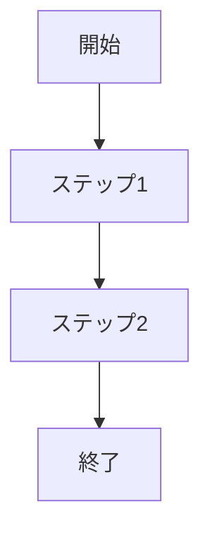

# ID: RDD-BFL-[YYYY]-[NNN]

# 業務フロー: [業務フロー名]

## 概要

[この業務フローの目的と概要を簡潔に記述します。]

### アクター

- [アクターID: ACT-XXX]
- [アクターID: ACT-XXX]

### トリガー

[この業務フローが開始されるきっかけを記述します。]

### フロー

[業務フローのステップを記述します。業務フロー図（Mermaid記法 graph
TD）を**必須**とします。これにより、複雑な業務プロセスも直感的に理解しやすくなります。]

### 例外処理

- [例外処理1の記述]
- [例外処理2の記述]

### 関連する機能要件

- [機能ID: FR-XXX]
- [機能ID: FR-XXX]

### 関連するアクター

- [アクターID: ACT-XXX]
- [アクターID: ACT-XXX]

### 関連する画面

- [画面ID: SCR-XXX]
- [画面ID: SCR-XXX]
