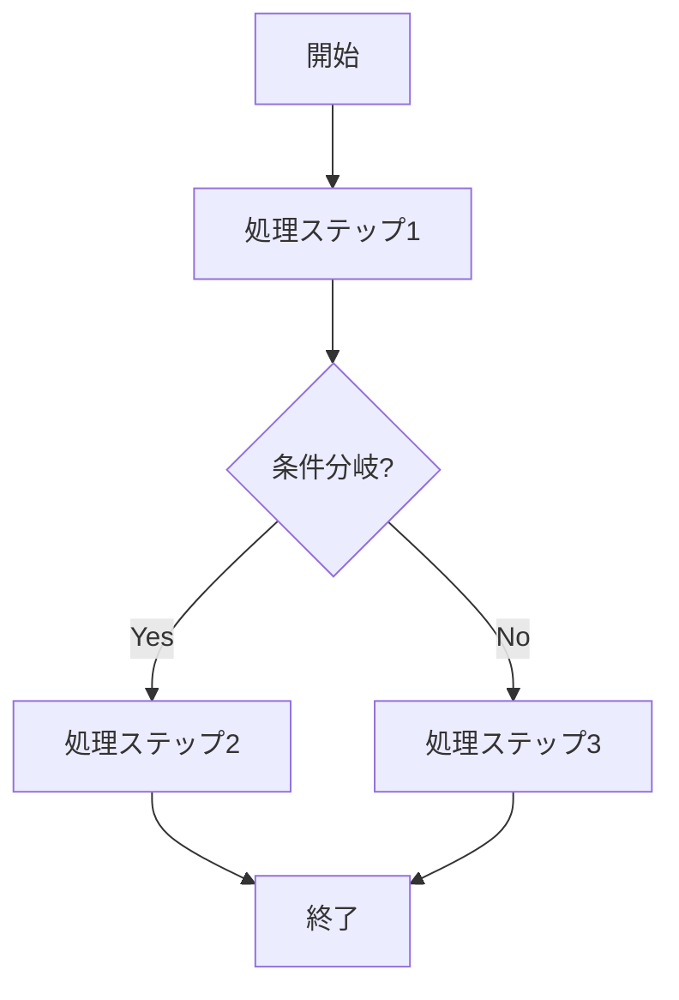

# ID: RDD-FRQ-[YYYY]-[NNN]

# 機能: [機能名]

## 概要

[この機能の目的と概要を簡潔に記述します。]

### 入力

- [入力項目1]: [データ型], [制約], [説明]
- [入力項目2]: [データ型], [制約], [説明]

### 処理内容

[この機能がどのような処理を行うかを詳細に記述します。アルゴリズムやビジネスロジックを含みます。機能フロー図やデータフロー図（Mermaid記法
graph
TD）を**必須**とします。これにより、機能の内部動作やデータ連携を明確にし、理解を深めることができます。]

### 出力

- [出力項目1]: [データ型], [説明]
- [出力項目2]: [データ型], [説明]

### エラー処理

- [エラーケース1]: [エラーメッセージ], [システム挙動], [ユーザーへの影響]
- [エラーケース2]: [エラーメッセージ], [システム挙動], [ユーザーへの影響]

### 関連するユースケース

- [ユースケースID: UC-XXX]
- [ユースケースID: UC-XXX]

### 関連する業務フロー

- [業務フローID: BF-XXX]
- [業務フローID: BF-XXX]

### 関連する非機能要件

- [非機能要件ID: NFR-XXX]
- [非機能要件ID: NFR-XXX]

### 関連する画面

- [画面ID: SCR-XXX]
- [画面ID: SCR-XXX]
